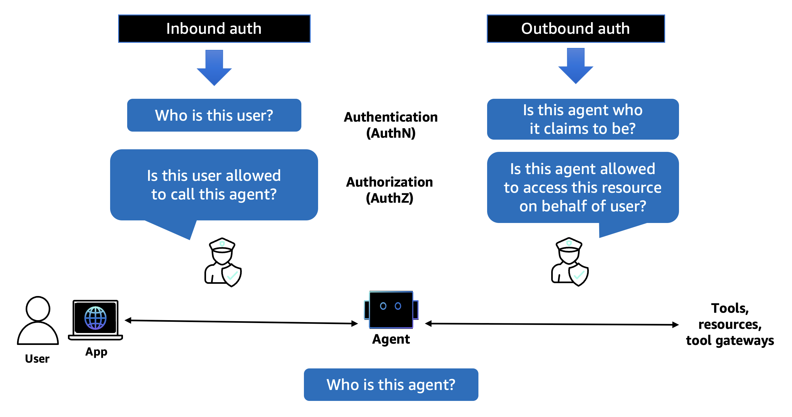

# Amazon Bedrock AgentCore Identity

## Overview

Amazon Bedrock AgentCore Identity is a comprehensive identity and credential management service designed specifically for AI agents and automated workloads. It provides secure authentication, authorization, and credential management capabilities that enable users to invoke agents, and agents to access external resources and services on behalf of users while maintaining strict security controls and audit trails.

AgentCore Identity addresses a fundamental challenge in AI agent deployment: enabling agents to securely access user-specific data across multiple services without compromising security or user experience. The service operates on the principle of **delegation rather than impersonation**, where agents authenticate as themselves while carrying verifiable user context.

## Key Features

- **Inbound Authentication**: Validate access for users and applications calling agents or tools
- **Outbound Authentication**: Secure access from agents to external services on behalf of users
- **OAuth Integration**: Support for 2-legged and 3-legged OAuth flows
- **AWS IAM Integration**: Native integration with AWS identity and access management
- **Zero Trust Security**: Every request is validated regardless of source or previous trust relationships
- **Cross-Platform Support**: Works across AWS, other cloud providers, and on-premise environments

## Authentication Types

AgentCore Identity supports two primary authentication patterns:

### Inbound Auth
Validates access for users and applications calling agents or tools in AgentCore Runtime or Gateway targets. Supports:
- **AWS IAM**: Direct IAM-based access control
- **OAuth**: Token-based authentication without requiring IAM permissions for end users

### Outbound Auth
Enables agents to access AWS services and external resources on behalf of users:
- **AWS Resources**: Uses IAM execution roles for AWS service access
- **External Services**: OAuth 2-legged (client credentials) and 3-legged (authorization code) flows

## How It Works

AgentCore Identity implements a comprehensive workflow that orchestrates authentication and authorization across multiple trust domains:

1. **User Authentication**: Users authenticate through existing identity providers (Cognito, Auth0, etc.)
2. **Agent Authorization**: Applications request agent access with user tokens
3. **Token Exchange**: AgentCore Identity validates user tokens and issues workload access tokens
4. **Resource Access**: Agents use workload tokens to access AWS and third-party resources
5. **Delegation & Audit**: All actions maintain user context and audit trails

For detailed technical information, see [How AgentCore Identity Works](02-how_it_works.md).

## Tutorial Examples

This tutorial includes four hands-on examples demonstrating different authentication scenarios:

| Example | Type | Description |
|---------|------|-------------|
| **[Inbound Auth Example](03-Inbound%20Auth%20example)** | Inbound | User authentication with Strands agents and Bedrock models |
| **[Outbound Auth Example](04-Outbound%20Auth%20example)** | Outbound | Agent access to external services with Strands and OpenAI |
| **[3-Legged OAuth](05-Outbound_Auth_3lo)** | Outbound | User-delegated access with Cognito and 3-legged OAuth flow with Google |
| **[GitHub Integration](06-Outbound_Auth_Github)** | Outbound | GitHub API access using 3-legged OAuth authentication |

Each example includes:
- Complete Jupyter notebook walkthrough
- Step-by-step setup instructions
- Code samples and explanations
- Best practices and security considerations

## Getting Started

1. **Read the Introduction**: Start with [Getting Started](01-getting_started.md) to understand AgentCore Identity concepts
2. **Understand the Workflow**: Review [How It Works](02-how_it_works.md) for technical details
3. **Choose an Example**: Select a tutorial example based on your authentication needs:
   - For user authentication to agents: Start with **Inbound Auth Example**
   - For agent access to external services: Try **Outbound Auth Example**
   - For user-delegated access patterns: Explore **3-Legged OAuth** or **GitHub Integration**

## Key Benefits

- **Enhanced Security**: Zero trust authentication with fine-grained access controls
- **User Experience**: Seamless access without repeated authentication prompts
- **Audit & Compliance**: Complete audit trails for all agent actions
- **Framework Agnostic**: Works with any agent framework (Strands, LangGraph, CrewAI, etc.)
- **Scalable**: Enterprise-ready with support for multiple identity providers
- **Standards-Based**: Built on OAuth 2.0, OIDC, and industry security standards

## Architecture Integration

AgentCore Identity integrates seamlessly with other AgentCore components:

- **AgentCore Runtime**: Provides authentication for hosted agents
- **AgentCore Gateway**: Secures access to tools and external APIs  
- **AgentCore Memory**: Maintains secure access to user-specific memory stores
- **Third-Party Services**: Enables secure integration with external APIs and services

## Next Steps

After completing the tutorials, you can:
- Integrate AgentCore Identity with your existing identity infrastructure
- Configure custom OAuth providers and scopes
- Implement advanced security policies and access controls
- Deploy production-ready agent authentication workflows
- Scale your secure agent infrastructure across multiple services and platforms
