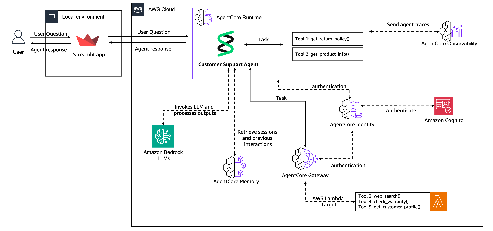

# End-to-end Customer Support Agent with AgentCore

In this tutorial we will move a customer support agent from prototype to production using Amazon Bedrock AgentCore services.

## What You'll Build

A complete customer support system that starts as a simple prototype and evolves into a scalable and secure sample application. 

Your final system will handle real customer conversations with memory, shared tools, and a web interface.

> [!IMPORTANT]
> The examples provided here is for educational purposes. It demonstrates how the different services from AgentCore are used on the process of migrating an agentic use case from prototype to production. As such, it is not intended for direct use in production environments.

**Journey Overview:**
- Start with a basic agent prototype (20 mins)
- Add conversation memory across sessions (20 mins) 
- Share tools securely across multiple agents (30 mins)
- Deploy to production with monitoring (30 mins)
- Build a customer-facing web app (20 mins)

## Architecture Overview

By the end of the 5 labs of this tutorial you will have created the following architecture

    

## Prerequisites

- AWS account with Bedrock access
- Python 3.10+
- AWS CLI configured
- Claude 3.7 Sonnet enabled in Bedrock

## Labs

### Lab 1: Create Agent Prototype
Build a prototype of a customer support agent with three core tools:
- Return policy lookup
- Product information search  
- Web search for troubleshooting

**What you'll learn:** Basic agent creation with Strands Agents and tool integration

### Lab 2: Add Memory
Transform your "goldfish agent" into one that remembers customers across conversations.
- Persistent conversation history
- Customer preference extraction
- Cross-session context awareness

**What you'll learn:** AgentCore Memory for both short-term and long-term persistence

### Lab 3: Scale with Gateway & Identity
Move from local tools to shared, enterprise-ready services.
- Centralized tool management
- JWT-based authentication
- Integration with existing AWS Lambda functions

**What you'll learn:** AgentCore Gateway and AgentCore Identity for secure tool sharing

### Lab 4: Deploy to Production  
Deploy your agent to handle real traffic with full observability.
- Fully managed deployment
- Session Continuity and Session Isolation
- CloudWatch Observability integration

**What you'll learn:** AgentCore Runtime with production-grade observability

### Lab 5: Build Customer Interface
Create a web app customers can actually use.
- Streamlit-based chat interface
- Real-time response streaming
- Session management and authentication

**What you'll learn:** Frontend integration with secure agent endpoints

## Getting Started

1. Clone this repository
2. Install dependencies: `pip install -r requirements.txt`
3. Configure AWS credentials
4. Start with [Lab 1](lab-01-create-an-agent.ipynb)

Each lab builds on the previous one, but you can jump ahead if you understand the concepts.

## Architecture Evolution

Watch your architecture grow from a simple local agent to a production system:

**Lab 1:** Local agent with embedded tools  
**Lab 2:** Agent + AgentCore Memory for persistence  
**Lab 3:** Agent + AgentCore Memory + AgentCore Gateway and AgentCore Identity for shared tools  
**Lab 4:** Deployment to AgentCore Runtime and observability with AgentCore Observability 
**Lab 5:** Customer-facing application with authentication

Ready to build? [Start with Lab 1 →](lab-01-create-an-agent.ipynb)