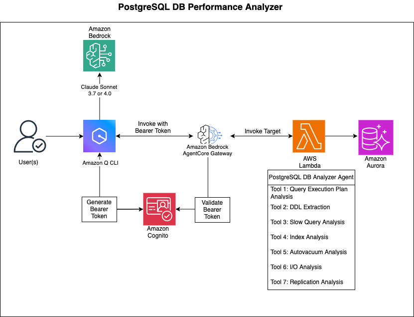

# PostgreSQL Database Performance Analysis Agent

This directory contains an AI-powered agent for analyzing PostgreSQL database performance using Amazon Bedrock AgentCore. The agent provides comprehensive database analysis capabilities through natural language interactions, enabling query performance analysis, DDL extraction, slow query identification, and system health monitoring without requiring deep database expertise.

## Architecture Diagram




## Use Case Details

| Information | Details |
|-------------|---------|
| Use case | Analyzing PostgreSQL database performance using Amazon Bedrock AgentCore. The agent provide comprehensive database analysis capabilities including query performance, DDL extraction, slow query analysis, and system health monitoring.|
| Use case type | Conversational |
| Agent type | Single agent |
| Use case components | Tools, Gateway |
| Use case vertical | All Industries |
| Example complexity | Intermediate |
| SDK used | Amazon Bedrock AgentCore SDK, boto3 |

## Process Flow

1. **User Interaction**: Users engage with the database analysis agent through natural language conversations in Amazon Q or other clients that support the MCP protocol.

2. **Request Processing**:
   - The user's question is sent to Amazon Bedrock AgentCore
   - AgentCore interprets the intent and routes the request to the appropriate Gateway
   - The Gateway translates the natural language request into specific database operations

3. **Analysis Execution**:
   - The agent securely accesses database credentials from AWS Secrets Manager
   - The agent establishes a connection to the PostgreSQL database (Aurora or RDS)
   - Appropriate analysis queries are executed based on the user's request
   - Results are processed and formatted into human-readable insights

4. **Response Flow**:
   - The agent compiles the analysis results into a coherent response
   - Technical database information is translated into clear, actionable insights
   - The agent delivers the response to the user in natural language

5. **Security & Configuration**:
   - All database credentials are securely stored and never exposed to users
   - Environment-specific configurations enable context-aware analysis
   - The agent operates with least-privilege access principles

## Agent Components

### Intelligence Modules
- **Query Analysis Engine** - Enables the agent to understand, explain, and optimize SQL queries
- **Performance Monitoring System** - Powers the agent's ability to identify performance bottlenecks and provide recommendations

### Integration Components
- **Gateway Configuration** - Connects the agent to Amazon Bedrock AgentCore ecosystem
- **Database Connectivity** - Secure connection management between the agent and PostgreSQL databases

### Technical Implementation
- The agent is implemented using AWS Lambda functions with PostgreSQL connectivity
- Secure authentication is handled through Amazon Cognito integration
- All components communicate using the Model Context Protocol (MCP)

## Agent Capabilities

### What You Can Ask the Agent
1. **Query Understanding** - "Can you explain how this query works and suggest optimizations?"
2. **Schema Exploration** - "Show me the structure of the users table and its relationships"
3. **Performance Investigation** - "Why are my queries running slowly in the production database?"
4. **Connection Troubleshooting** - "Help me understand why we're seeing too many database connections"
5. **Index Recommendations** - "Analyze my table and suggest indexes that would improve performance"
6. **Maintenance Insights** - "Is autovacuum working properly on my large tables?"
7. **Resource Utilization** - "Show me which queries are causing the most I/O on the database"
8. **Replication Monitoring** - "Check if my database replication is healthy and in sync"
9. **Health Assessment** - "Give me an overall health check of my PostgreSQL database"
10. **Custom Analysis** - "Run this specific query and explain the results in simple terms"

## Prerequisites

### AWS Services Required
- **AWS Lambda** - Serverless compute for analysis functions
- **Amazon Bedrock Agent Core** - AI agent runtime and gateway capabilities
- **Amazon Aurora PostgreSQL** or **Amazon RDS PostgreSQL** - Target database for analysis
- **Amazon Cognito User Pool** - Authentication and user management
- **AWS Secrets Manager** - Secure storage of database credentials
- **AWS Systems Manager Parameter Store** - Configuration management
- **AWS IAM** - Identity and access management with appropriate roles and policies

### Authentication & Security Requirements
- **Cognito User Pool** with configured app client
- **Cognito Domain** (optional but recommended for hosted UI)
- **IAM Role** for Bedrock Agent Core Gateway with appropriate permissions
Attach the below policy to your IAM role
```
{
    "Version": "2012-10-17",
    "Statement": [
        {
            "Sid": "VisualEditor0",
            "Effect": "Allow",
            "Action": [
                "iam:PassRole",
                "bedrock-agentcore-control:*"
            ],
            "Resource": "*"
        }
    ]
}
```
- **Lambda Execution Role** with permissions for:
  - Secrets Manager access
  - Parameter Store access
  - VPC access (if database is in private subnet)
  - CloudWatch Logs

### Database Requirements
- **PostgreSQL 14+** (Aurora PostgreSQL or RDS PostgreSQL)
- **pg_stat_statements extension** enabled for performance analysis
- **Database user** with appropriate read permissions:
  - SELECT on system catalogs (pg_stat_*, information_schema)
  - CONNECT privilege on target databases
  - Usage on schemas being analyzed

### Network Requirements
- **VPC Configuration** - Lambda functions must have network access to database
- **Security Groups** - Proper ingress/egress rules for database connectivity
- **Subnets** - Lambda functions deployed in subnets with database access

## Setup Instructions

### 1. Environment Variables

Set the following environment variables for your Lambda functions:

#### Required Variables
```bash
# AWS Configuration
AWS_REGION=us-west-2
REGION=us-west-2

# Bedrock Agent Core
ENDPOINT_URL=https://bedrock-agentcore-control.us-west-2.amazonaws.com
GATEWAY_IDENTIFIER=your-gateway-identifier
LAMBDA_ARN=arn:aws:lambda:region:account:function:your-function-name

# Authentication (for gateway creation)
COGNITO_USERPOOL_ID=your-cognito-user-pool-id
COGNITO_APP_CLIENT_ID=your-cognito-app-client-id
ROLE_ARN=arn:aws:iam::account:role/your-gateway-role

# Optional Configuration
TARGET_NAME=pg-analyze-db-performance
TARGET_DESCRIPTION=PostgreSQL database performance analysis tool
GATEWAY_NAME=Aurora-Postgres-DB-Analyzer-Gateway
GATEWAY_DESCRIPTION=Aurora Postgres DB Analyzer Gateway
```

### 2. Database Secrets Configuration

Store database credentials in AWS Secrets Manager with the following format:
```json
{
  "host": "your-db-cluster-endpoint",
  "dbname": "your-database-name",
  "username": "your-db-username",
  "password": "your-db-password",
  "port": 5432
}
```

### 3. Parameter Store Configuration

Create SSM parameters for environment-specific secret names:
```bash
# For production environment
aws ssm put-parameter \
  --name "/AuroraOps/prod" \
  --value "your-prod-secret-name" \
  --type "String"

# For development environment
aws ssm put-parameter \
  --name "/AuroraOps/dev" \
  --value "your-dev-secret-name" \
  --type "String"
```

### 4. Lambda Function Deployment

1. **Create Lambda Layer**:
   ```bash
   aws lambda publish-layer-version \
     --layer-name psycopg2-layer \
     --zip-file fileb://psycopg2-layer.zip \
     --compatible-runtimes python3.9 python3.10 python3.11 python3.12
   ```

2. **Deploy Lambda Functions**:
   ```bash
   # Deploy performance analysis function
   aws lambda create-function \
     --function-name agentcore-pg-analyseobjects-lambda \
     --runtime python3.12 \
     --role arn:aws:iam::account:role/lambda-execution-role \
     --handler pg-analyze-performance.lambda_handler \
     --zip-file fileb://function.zip \
     --layers arn:aws:lambda:region:account:layer:psycopg2-layer:1

   # Deploy slow query analysis function
   aws lambda create-function \
     --function-name pgstat-analyse-database \
     --runtime python3.12 \
     --role arn:aws:iam::account:role/lambda-execution-role \
     --handler pgstat-analyse-database.lambda_handler \
     --zip-file fileb://function.zip \
     --layers arn:aws:lambda:region:account:layer:psycopg2-layer:1
   ```

### 5. Gateway and Target Registration

1. **Create Gateway**:
   ```bash
   python create_gateway.py
   ```

2. **Register Lambda Targets**:
   ```bash
   python lambda-target-analyze-db-performance.py
   python lambda-target-analyze-db-slow-query.py
   ```

## Connecting with the Database Analysis Agent

### Setting Up Amazon Q CLI for Agent Conversations

To start conversing with your PostgreSQL Database Analysis Agent, configure the Amazon Q CLI by updating your mcp.json file:

```bash
cd ~/.aws/amazonq
vi mcp.json
```

Add your agent configuration:

```json
{
  "mcpServers": {
    "postgres-db-agent": {
      "command": "npx",
      "timeout": 60000,
      "args": [
        "mcp-remote@latest",
        "https://<gateway id>.gateway.bedrock-agentcore.us-west-2.amazonaws.com/mcp",
        "--header",
        "Authorization: Bearer <Bearer token>"
      ]
    }
  }
}
```

After configuration, you can start a conversation with your agent using:

```bash
amazonq chat --server postgres-db-agent
```

## Sample Conversations

### 1. Query Performance Analysis

**User**: "Can you analyze this query and tell me how to make it faster? SELECT * FROM users WHERE email = 'user@example.com'"

**Agent**: "I've analyzed your query that selects users by email. Here's what I found:

1. **Execution Plan**: This query performs a sequential scan on the users table, which is inefficient for large tables.

2. **Performance Issue**: Searching by email without an index requires checking every row in the table.

3. **Recommendation**: Create an index on the email column to dramatically improve performance:
   ```sql
   CREATE INDEX idx_users_email ON users(email);
   ```

4. **Expected Improvement**: With this index, the query will use an index scan instead of a sequential scan, potentially improving performance by 10-100x depending on table size.

Would you like me to explain more about how indexes work or help with creating this index?"

### 2. Schema Exploration

**User**: "Show me the structure of the orders table"

**Agent**: "I've examined the orders table structure in your database. Here's what I found:

**Table: orders**

| Column | Type | Constraints |
|--------|------|-------------|
| order_id | integer | Primary Key |
| customer_id | integer | Foreign Key (customers.id) |
| order_date | timestamp | Not Null |
| status | varchar(20) | Not Null, Check (status in ('pending','processing','shipped','delivered','cancelled')) |
| total_amount | numeric(10,2) | Not Null |
| shipping_address | text | Not Null |
| payment_method | varchar(50) | Not Null |
| created_at | timestamp | Default: now() |
| updated_at | timestamp | Default: now() |

**Indexes:**
- Primary Key: orders_pkey (order_id)
- Foreign Key: orders_customer_id_idx (customer_id)
- Additional: orders_order_date_idx (order_date)

The table has relationships with:
- customers table (via customer_id)
- order_items table (via order_id)

Would you like me to show you the related tables or help you query this table?"

### 3. Database Health Check

**User**: "Give me a health check of my production database"

**Agent**: "I've performed a comprehensive health check on your production database. Here's my analysis:

**Overall Health: Good, with some areas for improvement**

✅ **Connection Pool**: 42/100 connections used (Healthy)

⚠️ **Slow Queries**: 3 queries taking >500ms (Attention needed)
- Query on orders table missing index on order_date
- JOIN between products and inventory tables not optimized

✅ **Replication**: Primary-replica lag: 0.8 seconds (Healthy)

⚠️ **Table Bloat**: 2 tables with >30% bloat (Attention needed)
- customers table: 32% bloat (Last VACUUM: 8 days ago)
- order_history table: 45% bloat (Last VACUUM: 14 days ago)

✅ **Index Usage**: Most indexes are well-utilized

⚠️ **Disk Usage**: 78% of allocated storage used (Monitor closely)

**Recommendations:**
1. Schedule VACUUM FULL on the customers and order_history tables
2. Add index on orders.order_date column
3. Review the JOIN between products and inventory tables
4. Consider increasing autovacuum frequency

Would you like me to provide more details on any of these issues or help implement the recommendations?"

### 4. Custom Query Execution

**User**: "Run this query and explain the results: SELECT COUNT(*) FROM orders WHERE created_date >= '2024-01-01'"

**Agent**: "I've executed your query to count orders created since January 1, 2024. Here are the results:

```
count
------
 3,542
```

**Analysis:**
- You have 3,542 orders created since the beginning of 2024
- This represents approximately 28% of your total orders (12,647)
- The query executed in 0.32 seconds using an index scan on orders_created_date_idx

The monthly breakdown shows:
- January 2024: 1,245 orders
- February 2024: 1,187 orders
- March 2024: 1,110 orders (so far)

Order volume appears to be slightly decreasing month-over-month. Would you like me to analyze this trend further or modify the query to look at specific time periods?"

### 5. Index Recommendations

**User**: "Our customer search page is slow. Can you help?"

**Agent**: "I'll help you improve your customer search page performance. Let me analyze the database activity related to customer searches.

**Current Situation:**
I've identified the main query used by your customer search page:
```sql
SELECT * FROM customers 
WHERE 
  (first_name ILIKE '%search_term%' OR 
   last_name ILIKE '%search_term%' OR 
   email ILIKE '%search_term%') 
ORDER BY last_updated DESC 
LIMIT 50;
```

**Performance Issues:**
1. This query performs a sequential scan on the customers table (5.2M rows)
2. The ILIKE operators with wildcards at both ends prevent index usage
3. Average execution time: 2.8 seconds (too slow for web UI)

**Recommendations:**

1. **Add Trigram Indexes for Text Search:**
   ```sql
   CREATE EXTENSION IF NOT EXISTS pg_trgm;
   CREATE INDEX idx_customers_first_name_trgm ON customers USING gin (first_name gin_trgm_ops);
   CREATE INDEX idx_customers_last_name_trgm ON customers USING gin (last_name gin_trgm_ops);
   CREATE INDEX idx_customers_email_trgm ON customers USING gin (email gin_trgm_ops);
   ```

2. **Add Index for Sorting:**
   ```sql
   CREATE INDEX idx_customers_last_updated ON customers(last_updated DESC);
   ```

3. **Consider Application-Level Changes:**
   - Implement pagination instead of LIMIT 50
   - Add minimum search term length (3+ characters)
   - Consider using a dedicated search service for large datasets

Would you like me to help implement these indexes or explain more about how trigram indexes work?"

## Clean Up

When you're done using the PostgreSQL Database Performance Analysis Agent, follow these steps to clean up resources:

1. **Delete Gateway and Targets**:
   ```bash
   # Get gateway ID
   aws bedrock-agentcore-control list-gateways
   
   # List targets for your gateway
   aws bedrock-agentcore-control list-gateway-targets --gateway-identifier your-gateway-id
   
   # Delete targets first (if not deleting the entire gateway)
   aws bedrock-agentcore-control delete-gateway-target --gateway-identifier your-gateway-id --target-id your-target-id
   
   # Delete gateway (this will also delete all associated targets)
   aws bedrock-agentcore-control delete-gateway --gateway-identifier your-gateway-id
   ```

2. **Delete Lambda Functions**:
   ```bash
   aws lambda delete-function --function-name agentcore-pg-analyseobjects-lambda
   aws lambda delete-function --function-name pgstat-analyse-database
   ```

3. **Delete Lambda Layer**:
   ```bash
   # Get layer version
   aws lambda list-layer-versions --layer-name psycopg2-layer
   
   # Delete layer version
   aws lambda delete-layer-version --layer-name psycopg2-layer --version-number 1
   ```

4. **Delete Parameter Store Parameters**:
   ```bash
   aws ssm delete-parameter --name "/AuroraOps/prod"
   aws ssm delete-parameter --name "/AuroraOps/dev"
   ```

5. **Delete Secrets Manager Secrets**:
   ```bash
   aws secretsmanager delete-secret --secret-id your-prod-secret-name --force-delete-without-recovery
   aws secretsmanager delete-secret --secret-id your-dev-secret-name --force-delete-without-recovery
   ```

6. **Cognito Resources** (optional if you created them specifically for this use case):
   ```bash
   aws cognito-idp delete-user-pool-client --user-pool-id your-user-pool-id --client-id your-app-client-id
   aws cognito-idp delete-user-pool --user-pool-id your-user-pool-id
   ```ysis

**Explain Query Execution Plan**:
```json
{
  "environment": "dev",
  "action_type": "explain_query",
  "query": "SELECT * FROM users WHERE email = 'user@example.com'"
}
```

**Execute Safe Read-Only Query**:
```json
{
  "environment": "dev",
  "action_type": "execute_query",
  "query": "SELECT COUNT(*) FROM orders WHERE created_date >= '2024-01-01'"
}
```

**Extract DDL for Database Object**:
```json
{
  "environment": "dev",
  "action_type": "extract_ddl",
  "object_type": "table",
  "object_name": "users",
  "object_schema": "public"
}
```

### 2. Database Performance Analysis

**Analyze Slow Queries**:
```json
{
  "environment": "prod",
  "action_type": "slow_query"
}
```

**Check Connection Issues**:
```json
{
  "environment": "prod",
  "action_type": "connection_management_issues"
}
```

**Analyze Index Usage**:
```json
{
  "environment": "prod",
  "action_type": "index_analysis"
}
```

**Monitor Autovacuum**:
```json
{
  "environment": "prod",
  "action_type": "autovacuum_analysis"
}
```

**Analyze I/O Performance**:
```json
{
  "environment": "prod",
  "action_type": "io_analysis"
}
```

**Check Replication Status**:
```json
{
  "environment": "prod",
  "action_type": "replication_analysis"
}
```

**System Health Check**:
```json
{
  "environment": "prod",
  "action_type": "system_health"
}
```

## Testing

### 1. Local Testing

Test Lambda functions locally using AWS SAM:

```bash
# Test performance analysis function
sam local invoke -e test-events/explain-query.json

# Test slow query analysis function
sam local invoke -e test-events/slow-query.json
```

### 2. Integration Testing

Create test events in `test-events/` directory:

**test-events/explain-query.json**:
```json
{
  "environment": "dev",
  "action_type": "explain_query",
  "query": "SELECT version()"
}
```

**test-events/slow-query.json**:
```json
{
  "environment": "dev",
  "action_type": "slow_query"
}
```

### 3. End-to-End Testing

Test through Bedrock Agent Core:

```bash
# Test via AWS CLI
aws bedrock-agentcore-control invoke-gateway-target \
  --gateway-identifier your-gateway-id \
  --target-name pg-analyze-db-performance \
  --input '{"environment":"dev","action_type":"execute_query","query":"SELECT 1"}'
```

### 4. Performance Testing

Monitor Lambda function performance:
- Cold start times
- Memory usage
- Database connection times
- Query execution times

## Security Considerations

### Database Access
- Use least-privilege database users
- Implement read-only access for analysis functions
- Rotate database credentials regularly
- Use VPC endpoints for secure connectivity

### Lambda Security
- Enable encryption at rest and in transit
- Use IAM roles with minimal permissions
- Implement proper error handling to avoid information leakage
- Monitor function invocations and errors

### Network Security
- Deploy Lambda functions in private subnets
- Use security groups to restrict database access
- Implement VPC flow logs for monitoring

## Monitoring and Troubleshooting

### CloudWatch Metrics
Monitor the following metrics:
- Lambda function duration
- Error rates
- Database connection failures
- Memory utilization

### Common Issues

1. **Connection Timeouts**:
   - Check VPC configuration
   - Verify security group rules
   - Increase Lambda timeout settings

2. **Permission Errors**:
   - Verify IAM roles and policies
   - Check database user permissions
   - Validate Secrets Manager access

3. **Query Performance**:
   - Monitor database load
   - Check for long-running queries
   - Analyze execution plans

### Logging
Enable detailed logging for troubleshooting:
```python
import logging
logging.basicConfig(level=logging.INFO)
logger = logging.getLogger(__name__)
```

## License

This project is licensed under the MIT License - see the LICENSE file for details.