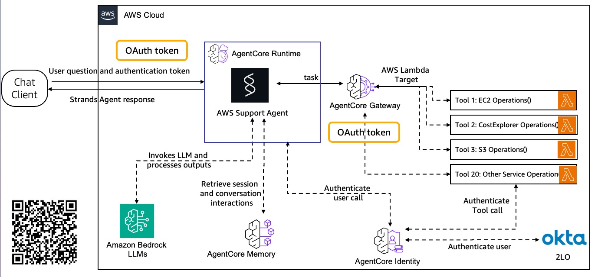

# AWS Support Agent with Amazon Bedrock AgentCore

An AWS support conversational AI system built on Amazon Bedrock AgentCore, featuring OAuth2 authentication, MCP (Model Control Protocol) integration, and comprehensive AWS service operations.

## Demo


*Interactive demonstration of the AWS Support Agent powered by Amazon Bedrock AgentCore*

## Architecture Overview



The system follows a secure, distributed architecture:

1. **Chat Client** authenticates users via Okta OAuth2 and sends questions with JWT tokens
2. **AgentCore Runtime** validates tokens, processes conversations, and maintains session memory
3. **AgentCore Gateway** provides secure tool access through MCP protocol
4. **AWS Lambda Target** executes AWS service operations with proper authentication
5. **AgentCore Identity** manages workload authentication and token exchange

## Key Features

- 🔐 **Enterprise Authentication**: Okta OAuth2 with JWT token validation
- 🤖 **Dual Agent Architecture**: Both FastAPI (DIY) and BedrockAgentCoreApp (SDK) implementations
- 🧠 **Conversation Memory**: Persistent session storage with AgentCore Memory
- 🔗 **MCP Integration**: Standardized tool communication protocol
- 🛠️ **20+ AWS Tools**: Comprehensive read-only operations across AWS services
- 📊 **Production Ready**: Complete deployment automation and infrastructure management

## Project Structure

```
AgentCore/
├── README.md                           # This documentation
├── requirements.txt                    # Python dependencies
├── config/                             # 🔧 Configuration management
│   ├── static-config.yaml              # Manual configuration settings
│   └── dynamic-config.yaml             # Runtime-generated configuration
│
├── shared/                             # 🔗 Shared configuration utilities
│   ├── config_manager.py               # Central configuration management
│   └── config_validator.py             # Configuration validation
│
├── chatbot-client/                     # 🤖 Client application
│   ├── src/client.py                   # Interactive chat client
│   └── README.md                       # Client-specific documentation
│
├── agentcore-runtime/                  # 🚀 Main runtime implementation
│   ├── src/
│   │   ├── agents/                     # Agent implementations
│   │   │   ├── diy_agent.py            # FastAPI implementation
│   │   │   └── sdk_agent.py            # BedrockAgentCoreApp implementation
│   │   ├── agent_shared/               # Shared agent utilities
│   │   │   ├── auth.py                 # JWT validation
│   │   │   ├── config.py               # Agent configuration
│   │   │   ├── mcp.py                  # MCP client
│   │   │   ├── memory.py               # Conversation memory
│   │   │   └── responses.py            # Response formatting
│   │   └── utils/
│   │       └── memory_manager.py       # Memory management utilities
│   ├── deployment/                     # 🚀 Deployment scripts
│   │   ├── 01-prerequisites.sh         # IAM roles and prerequisites
│   │   ├── 02-create-memory.sh         # AgentCore Memory setup
│   │   ├── 03-setup-oauth-provider.sh  # OAuth2 provider configuration
│   │   ├── 04-deploy-mcp-tool-lambda.sh # MCP Lambda deployment
│   │   ├── 05-create-gateway-targets.sh # Gateway and targets setup
│   │   ├── 06-deploy-diy.sh            # DIY agent deployment
│   │   ├── 07-deploy-sdk.sh            # SDK agent deployment
│   │   ├── 08-delete-runtimes.sh       # Runtime cleanup
│   │   ├── 09-delete-gateways-targets.sh # Gateway cleanup
│   │   ├── 10-delete-mcp-tool-deployment.sh # MCP cleanup
│   │   ├── 11-delete-memory.sh         # Memory cleanup
│   │   ├── Dockerfile.diy              # DIY agent container
│   │   ├── Dockerfile.sdk              # SDK agent container
│   │   ├── deploy-diy-runtime.py       # DIY deployment automation
│   │   └── deploy-sdk-runtime.py       # SDK deployment automation
│   ├── gateway-ops-scripts/            # 🌉 Gateway management
│   │   └── [Gateway CRUD operations]
│   ├── runtime-ops-scripts/            # ⚙️ Runtime management
│   │   └── [Runtime and identity management]
│   └── tests/local/                    # 🧪 Local testing scripts
│
├── mcp-tool-lambda/                    # 🔧 AWS Tools Lambda
│   ├── lambda/mcp-tool-handler.py      # MCP tool implementation
│   ├── mcp-tool-template.yaml          # CloudFormation template
│   └── deploy-mcp-tool.sh              # Lambda deployment script
│
├── okta-auth/                          # 🔐 Authentication setup
│   ├── OKTA-OPENID-PKCE-SETUP.md      # Okta configuration guide
│   ├── iframe-oauth-flow.html          # OAuth flow testing
│   └── setup-local-nginx.sh           # Local development setup
│
└── docs/                               # 📚 Documentation
    └── images/
        └── agentcore-implementation.jpg # Architecture diagram
```

## Quick Start

### Prerequisites

- **AWS CLI** configured with appropriate permissions
- **Docker** and Docker Compose installed
- **Python 3.11+** installed
- **Okta developer account** and application configured
- **yq** tool for YAML processing (optional, fallback available)

### 1. Configure Settings

Edit the configuration files with your specific settings:

```bash
# Configure AWS and Okta settings
vim config/static-config.yaml

# Key settings to update:
# - aws.account_id: Your AWS account ID
# - aws.region: Your preferred AWS region  (this project tested on us-east-1)
# - okta.domain: Your Okta domain
# - okta.client_credentials.client_id: Your Okta client ID
# - okta.client_credentials.client_secret: Set via environment variable

# IMPORTANT: Update IAM policy files with your AWS account ID
# Replace YOUR_AWS_ACCOUNT_ID placeholder in these files:
sed -i "s/YOUR_AWS_ACCOUNT_ID/$(aws sts get-caller-identity --query Account --output text)/g" \
  agentcore-runtime/deployment/bac-permissions-policy.json \
  agentcore-runtime/deployment/bac-trust-policy.json

# Verify the account ID was updated correctly
grep -n "$(aws sts get-caller-identity --query Account --output text)" \
  agentcore-runtime/deployment/bac-permissions-policy.json \
  agentcore-runtime/deployment/bac-trust-policy.json
```

### 2. Deploy Infrastructure

Run the deployment scripts in sequence:

```bash
cd agentcore-runtime/deployment

# Set up AWS prerequisites and roles
./01-prerequisites.sh

# Create AgentCore Memory for conversation storage
./02-create-memory.sh

# Set up Okta OAuth2 provider
./03-setup-oauth-provider.sh

# Deploy MCP tools Lambda function
./04-deploy-mcp-tool-lambda.sh

# Create AgentCore Gateway and targets
./05-create-gateway-targets.sh

# Deploy the agents (choose one or both)
./06-deploy-diy.sh    # FastAPI implementation
./07-deploy-sdk.sh    # BedrockAgentCoreApp implementation
```

### 3. Test the System

#### Run Local Test Scripts
```bash
# Test local agent functionality
cd agentcore-runtime/tests/local
./test-diy-simple.sh    # Tests DIY agent with local tools
./test-sdk-mcp.sh       # Tests SDK agent with MCP gateway integration
```

#### Test with Direct curl Commands

**DIY Agent (Port 8080):**
```bash
# Start DIY agent
cd agentcore-runtime/tests/local && ./test-diy-simple.sh

# Test with curl (returns SSE stream)
curl -X POST http://localhost:8080/invocations \
  -H "Content-Type: application/json" \
  -d '{
    "prompt": "What time is it?",
    "session_id": "test-session-123",
    "actor_id": "user"
  }'

# Extract just the text response
curl -s -X POST http://localhost:8080/invocations \
  -H "Content-Type: application/json" \
  -d '{"prompt": "Hello!", "session_id": "demo", "actor_id": "user"}' \
  | grep '"type":"text_delta"' \
  | sed 's/.*"content": *"\([^"]*\)".*/\1/' \
  | tr -d '\n'

# Health check
curl http://localhost:8080/ping
# Returns: {"status":"healthy","agent_type":"diy"}
```

**SDK Agent (Port 8081):**
```bash
# Start SDK agent
cd agentcore-runtime/tests/local && ./test-sdk-mcp.sh

# Test with curl (returns different SSE format)
curl -X POST http://localhost:8081/invocations \
  -H "Content-Type: application/json" \
  -d '{
    "prompt": "What time is it?",
    "session_id": "test-session-456",
    "actor_id": "user"
  }'

# Health check
curl http://localhost:8081/ping
# Returns: {"status":"Healthy","time_of_last_update":1753954747}
```

#### Use the Interactive Chat Client
```bash
cd chatbot-client/src
python client.py
```

## Component Details

### Agent Implementations

#### DIY Agent (FastAPI)
- **Framework**: FastAPI with Uvicorn
- **Endpoint**: `/invoke` 
- **Features**: Custom implementation with full control over request/response handling
- **Container**: `agentcore-runtime/deployment/Dockerfile.diy`

#### SDK Agent (BedrockAgentCoreApp)
- **Framework**: BedrockAgentCoreApp SDK
- **Features**: Native AgentCore integration with built-in optimizations
- **Container**: `agentcore-runtime/deployment/Dockerfile.sdk`

### Authentication Flow

1. **User Authentication**: Users authenticate via Okta OAuth2 PKCE flow
2. **Token Validation**: AgentCore Runtime validates JWT tokens using Okta's discovery endpoint
3. **Workload Identity**: Runtime exchanges user tokens for workload access tokens
4. **Service Authentication**: Workload tokens authenticate with AgentCore Gateway and tools

### Memory Management

- **Storage**: AgentCore Memory service provides persistent conversation storage
- **Session Management**: Each conversation maintains session context across interactions
- **Retention**: Configurable retention periods for conversation data
- **Privacy**: Memory isolation per user session

### Tool Integration

The system provides 20+ AWS service tools through the MCP Lambda:

- **EC2**: Instance management and monitoring
- **S3**: Bucket operations and policy analysis
- **Lambda**: Function management and monitoring
- **CloudFormation**: Stack operations and resource tracking
- **IAM**: User, role, and policy management
- **RDS**: Database instance monitoring
- **CloudWatch**: Metrics, alarms, and log analysis
- **Cost Explorer**: Cost analysis and optimization
- **And many more...**

## Configuration Management

### Static Configuration (`config/static-config.yaml`)
Contains manually configured settings:
- AWS account and region settings
- Okta OAuth2 configuration
- Agent model settings
- Tool schemas and definitions

### Dynamic Configuration (`config/dynamic-config.yaml`)
Auto-generated during deployment:
- Runtime ARNs and endpoints
- Gateway URLs and identifiers
- OAuth provider configurations
- Memory service details

### Configuration Manager
The `shared/config_manager.py` provides:
- Unified configuration access
- Environment-specific settings
- Validation and error handling
- Backward compatibility

## Development

### Local Testing

```bash
# Test agents locally without full deployment
cd agentcore-runtime/tests/local

# Test DIY agent with simple conversation
./test-diy-simple.sh

# Test SDK agent with MCP tools
./test-sdk-mcp.sh

# Test MCP gateway functionality
./test-diy-ec2-mcp.sh
```

### Container Development

Both agents follow a standardized container structure:

```
/app/
├── shared/                     # Project-wide utilities
├── agent_shared/              # Agent-specific helpers
├── config/                    # Configuration files
│   ├── static-config.yaml
│   └── dynamic-config.yaml
├── [agent].py                 # Agent implementation
└── requirements.txt
```

### Adding New Tools

1. **Define tool schema** in `config/static-config.yaml`
2. **Implement tool logic** in `mcp-tool-lambda/lambda/mcp-tool-handler.py`
3. **Update gateway targets** using gateway-ops-scripts
4. **Test integration** with local test scripts

## Monitoring and Operations

### Runtime Management
```bash
cd agentcore-runtime/runtime-ops-scripts

# List all deployed runtimes
python runtime_manager.py list

# Check runtime details
python runtime_manager.py get <runtime_id>

# Test OAuth flow
python oauth_test.py test-config
```

### Gateway Management
```bash
cd agentcore-runtime/gateway-ops-scripts

# List all gateways
python list-gateways.py

# Check gateway targets
python list-targets.py

# Update gateway configuration
python update-gateway.py --gateway-id <id> --name "New Name"
```

### Log Analysis
- **CloudWatch Logs**: Agent runtime logs
- **Request Tracing**: Full request/response logging
- **Error Monitoring**: Centralized error tracking
- **Performance Metrics**: Response time and resource usage

## Cleanup

To remove all deployed resources:

```bash
cd agentcore-runtime/deployment

# Delete runtimes
./08-delete-runtimes.sh

# Delete gateways and targets  
./09-delete-gateways-targets.sh

# Delete MCP Lambda
./10-delete-mcp-tool-deployment.sh

# Delete memory and clear config
./11-delete-memory.sh

# Complete cleanup (optional)
./12-cleanup-everything.sh
```

## Security Best Practices

- **Token Validation**: All requests validated against Okta JWT
- **Least Privilege**: IAM roles follow principle of least privilege
- **Encryption**: All data encrypted in transit and at rest
- **Network Security**: Private networking with controlled access
- **Audit Logging**: Comprehensive audit trail for all operations

## Troubleshooting

### Common Issues

1. **Token Validation Failures**
   - Check Okta configuration in `static-config.yaml`
   - Verify JWT audience and issuer settings
   - Test with `oauth_test.py`

2. **Memory Access Issues**
   - Verify AgentCore Memory is deployed and available
   - Check memory configuration in `dynamic-config.yaml`
   - Test memory operations with local scripts

3. **Tool Execution Failures**
   - Check MCP Lambda deployment status
   - Verify gateway target configuration
   - Test individual tools with MCP client

4. **Container Startup Issues**
   - Check Docker build logs
   - Verify requirements.txt compatibility
   - Review container health endpoints

### Getting Help

1. **Check deployment logs** in CloudWatch
2. **Run diagnostic scripts** in runtime-ops-scripts
3. **Verify configuration** with config_manager validation
4. **Test components individually** using local test scripts

## License

This project is for educational and experimental purposes. Please ensure compliance with your organization's policies and AWS service terms.