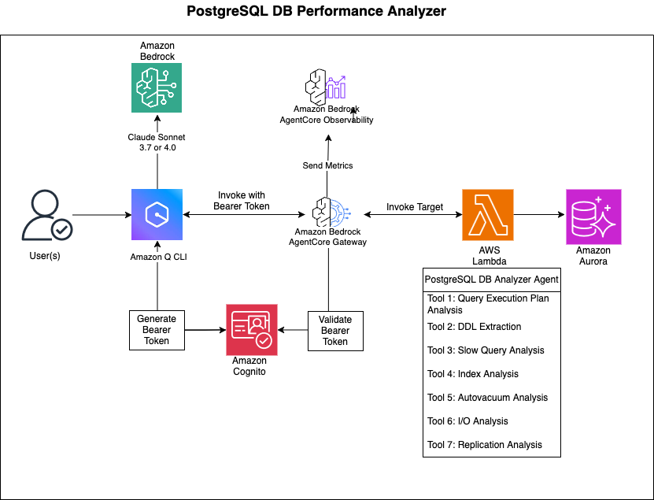

# AI-Powered DB Performance Analyzer

This project demonstrates how to build an AI-powered database performance analyzer using Amazon Bedrock AgentCore. It creates an intelligent agent that can analyze database performance, explain queries, provide recommendations, and help optimize your database operations through natural language conversations.

## Overview

The DB Performance Analyzer is an AI-powered assistant that helps database administrators and developers identify and resolve performance issues in PostgreSQL databases. By leveraging Amazon Bedrock AgentCore and large language models, it provides human-like analysis and recommendations based on database metrics and statistics.

## Use Cases

- **Performance Troubleshooting**: Quickly identify and diagnose slow queries, connection issues, and other performance bottlenecks
- **Index Optimization**: Analyze index usage and get recommendations for creating, modifying, or removing indexes
- **Resource Utilization**: Monitor and optimize CPU, memory, and I/O usage
- **Maintenance Planning**: Get insights into autovacuum performance and recommendations for maintenance tasks
- **Replication Monitoring**: Track replication lag and ensure high availability
- **Query Optimization**: Get explanations and improvement suggestions for complex queries

## Architecture



### VPC Connectivity

The Lambda functions are deployed in the same VPC as your database, allowing secure communication:

1. **Automatic VPC Detection**: The setup script automatically detects the VPC, subnets, and security groups of your database cluster
2. **Security Group Configuration**: Creates a dedicated security group for Lambda functions and configures the database security group to allow access
3. **Private Network Communication**: All database traffic stays within the VPC, never traversing the public internet
4. **Secure Credential Management**: Database credentials are stored in AWS Secrets Manager and accessed securely by the Lambda functions
5. **VPC Endpoints**: Properly configured VPC endpoints for AWS services like Secrets Manager and SSM with correct DNS settings

## Process Flow

1. **User Query**: The user asks a question about database performance in natural language through Amazon Q
2. **Query Processing**: Amazon Q processes the query and routes it to the appropriate AgentCore Gateway
3. **Tool Selection**: The AgentCore Gateway selects the appropriate tool based on the query
4. **Data Collection**: The Lambda function connects to the database and collects relevant metrics and statistics
5. **Analysis**: The Lambda function analyzes the collected data and generates insights
6. **Response Generation**: The results are formatted and returned to the user as natural language explanations and recommendations

## Project Structure

```
.
├── README.md               # This file
├── setup.sh                # Main setup script
├── setup_database.sh       # Database configuration script
├── cleanup.sh              # Cleanup script
├── setup_observability.sh  # Sets up observability for gateway and targets
├── cleanup_observability.sh # Cleans up observability resources
├── config/                 # Configuration files (generated during setup)
│   └── *.env               # Environment-specific configuration files (not committed to Git)
└── scripts/                # Supporting scripts
    ├── create_gateway.py   # Creates the AgentCore Gateway
    ├── create_iam_roles.sh # Creates necessary IAM roles
    ├── create_lambda.sh    # Creates Lambda functions
    ├── create_target.py    # Creates Gateway targets
    ├── lambda-target-analyze-db-performance.py # Performance analysis tools
    ├── lambda-target-analyze-db-slow-query.py  # Slow query analysis tools
    ├── get_token.py        # Gets/refreshes authentication token
    └── test_vpc_connectivity.py # Tests connectivity to AWS services
```

### Configuration Files

The setup process automatically generates several configuration files in the `config/` directory:

- **cognito_config.env**: Contains Cognito user pool, client, and token information
- **gateway_config.env**: Contains Gateway ID, ARN, and region
- **iam_config.env**: Contains IAM role ARNs and account information
- **db_dev_config.env/db_prod_config.env**: Contains database connection information
- **vpc_config.env**: Contains VPC, subnet, and security group IDs
- **target_config.env**: Contains Gateway target configuration
- **pgstat_target_config.env**: Contains configuration for the pg_stat_statements target

These files contain sensitive information and are excluded from Git via `.gitignore`.

## Prerequisites

- AWS CLI configured with appropriate permissions
- Python 3.9 or higher
- Boto3 library installed
- jq command-line tool installed
- Access to an Amazon Aurora PostgreSQL or RDS PostgreSQL database
- Permissions to create secrets in AWS Secrets Manager
- Permissions to create parameters in AWS Systems Manager Parameter Store
- Permissions to create and modify VPC security groups
- Permissions to create Lambda functions with VPC configuration
- Permissions to create VPC endpoints (if your Lambda functions need to access AWS services)

## Setup Instructions

1. Clone the repository:
   ```bash
   git clone https://github.com/awslabs/amazon-bedrock-agentcore-samples.git
   cd amazon-bedrock-agentcore-samples/02-use-cases/02-DB-performance-analyzer
   ```

2. Create a Python virtual environment:
   ```bash
   python3 -m venv venv
   source venv/bin/activate
   pip install -r requirements.txt
   ```

3. Set up database access:
   ```bash
   ./setup_database.sh --cluster-name your-aurora-cluster --environment prod
   ```

   This script will:
   - Look for existing secrets for the cluster
   - If found, let you select one to use
   - If not found, prompt for username and password
   - Retrieve the cluster endpoint and port from RDS
   - Create a secret in AWS Secrets Manager with the required format
   - Store the secret name in SSM Parameter Store
   - Save the configuration to a file
   
   You can also specify an existing secret directly:
   ```bash
   ./setup_database.sh --cluster-name your-aurora-cluster --environment prod --existing-secret your-secret-name
   ```

4. Run the main setup script:
   ```bash
   ./setup.sh
   ```

   This script will:
   - Set up Amazon Cognito resources for authentication
   - Create necessary IAM roles
   - Create Lambda functions for DB performance analysis
   - Configure VPC endpoints for AWS services if needed
   - Create an Amazon Bedrock AgentCore Gateway
   - Create Gateway targets for the Lambda functions
   - Configure everything to work together

5. Configure Amazon Q to use the gateway:
   ```bash
   source venv/bin/activate
   python3 scripts/get_token.py
   deactivate
   ```

   This will update your `~/.aws/amazonq/mcp.json` file with the gateway configuration.

## Using the DB Performance Analyzer

Once set up, you can use the DB Performance Analyzer through Amazon Q:

1. Open Amazon Q CLI in your command prompt `q chat`
2. It will load the "db-performance-analyzer" agent
3. Ask questions about database performance, such as:
   - "Analyze slow queries in my production database"
   - "Check for connection management issues in dev environment"
   - "Analyze index usage in my database"
   - "Check for autovacuum issues in production"

## Available Analysis Tools

The DB Performance Analyzer provides several tools:

- **Slow Query Analysis**: Identifies and explains slow-running queries, providing recommendations for optimization
- **Connection Management**: Analyzes connection issues, idle connections, and connection patterns to improve resource utilization
- **Index Analysis**: Evaluates index usage, identifies missing or unused indexes, and suggests improvements
- **Autovacuum Analysis**: Checks autovacuum settings, monitors dead tuples, and recommends configuration changes
- **I/O Analysis**: Analyzes I/O patterns, buffer usage, and checkpoint activity to identify bottlenecks
- **Replication Analysis**: Monitors replication status, lag, and health to ensure high availability
- **System Health**: Provides overall system health metrics, including cache hit ratios, deadlocks, and long-running transactions
- **Query Explanation**: Explains query execution plans and provides optimization suggestions
- **DDL Extraction**: Extracts Data Definition Language (DDL) statements for database objects
- **Query Execution**: Safely executes queries and returns results

## Key Benefits

- **Natural Language Interface**: Interact with your database using plain English questions
- **Proactive Recommendations**: Get actionable suggestions to improve performance
- **Time Savings**: Quickly identify issues that would take hours to diagnose manually
- **Educational**: Learn about database internals and best practices through AI explanations
- **Accessible**: No need to remember complex SQL queries or monitoring commands
- **Comprehensive**: Covers multiple aspects of database performance in one tool

## Observability

The DB Performance Analyzer includes observability features to help you monitor and troubleshoot your AgentCore Gateway and Lambda targets.

### Quick Setup

1. Run the observability setup script:
   ```bash
   ./setup_observability.sh
   ```

2. Enable CloudWatch Transaction Search in the CloudWatch console.

3. View your data in CloudWatch Logs, X-Ray Traces, and Transaction Search.

### Cleanup

```bash
./cleanup_observability.sh
```

For comprehensive documentation on AgentCore observability features, including detailed setup instructions, configuration options for agents outside the runtime, custom headers, and best practices, see [AgentCore Observability](https://docs.aws.amazon.com/bedrock-agentcore/latest/devguide/observability.html).

## Troubleshooting

### VPC Connectivity Issues

If your Lambda functions are having trouble connecting to AWS services:

1. **Check DNS Settings**:
   - Ensure DNS resolution and DNS hostnames are enabled for your VPC
   - Verify that private DNS is enabled for your VPC endpoints

2. **Verify Environment Variables**:
   - Lambda functions need the `AWS_REGION` environment variable set correctly
   - For services like Secrets Manager, ensure the region is specified in the code

3. **Test Connectivity**:
   ```bash
   python3 scripts/test_vpc_connectivity.py
   ```

4. **Check Security Groups**:
   - Ensure the Lambda security group allows outbound traffic to the VPC endpoint security group
   - Ensure the VPC endpoint security group allows inbound traffic from the Lambda security group

5. **Check Route Tables**:
   - Ensure that the subnets where your Lambda function runs have route tables with proper routes

6. **Manual Verification Commands**:
   ```bash
   # Check DNS settings
   aws ec2 describe-vpc-attribute --vpc-id YOUR_VPC_ID --attribute enableDnsSupport
   aws ec2 describe-vpc-attribute --vpc-id YOUR_VPC_ID --attribute enableDnsHostnames

   # List VPC endpoints
   aws ec2 describe-vpc-endpoints --filters "Name=vpc-id,Values=YOUR_VPC_ID"

   # Check route tables for subnets
   aws ec2 describe-route-tables --filters "Name=association.subnet-id,Values=YOUR_SUBNET_ID"
   ```

### Lambda Function Issues

If your Lambda functions are failing with errors related to missing environment variables:

1. **Check Required Environment Variables**:
   - Ensure all required environment variables are set in the Lambda configuration
   - The `REGION` environment variable is particularly important for AWS service access

2. **Update Lambda Configuration**:
   ```bash
   aws lambda update-function-configuration \
     --function-name DBPerformanceAnalyzer \
     --environment "Variables={REGION=us-west-2}" \
     --region us-west-2
   ```

3. **Error Description**:
   If you see errors like `Error: Failed to extract database object DDL: 'REGION'` or `cannot access local variable 'conn'`, it's likely due to missing environment variables.

4. **Alternative Solution**:
   You can also update the Lambda function code to handle missing environment variables with sensible defaults:
   ```python
   region = os.getenv('REGION', os.getenv('AWS_REGION', 'us-west-2'))
   ```

### Secret Management Issues

If you're having trouble with database secrets:

1. **Check Secret Format**:
   - Secrets must contain `username`, `password`, `host`, `port`, and `dbname` fields
   - The setup_database.sh script now handles special characters in secret names

2. **Verify Secret Access**:
   - Ensure the Lambda execution role has permission to access the secret
   - Check that the secret is in the same region as the Lambda function

3. **Test Secret Access**:
   ```bash
   ./scripts/list_secrets.sh --filter your-cluster-name
   ```

### Observability Troubleshooting

If you don't see observability data:

1. **Check CloudWatch Transaction Search**: Ensure it's enabled in the CloudWatch console
2. **Verify Log Groups**: Check that the log groups exist for your gateway and targets
3. **Generate Traffic**: Make a few requests to the gateway to generate traces and logs

## Cleanup

To remove all resources created by this project:

```bash
./cleanup.sh
```

This will delete:
- Lambda functions
- Gateway targets
- Gateway
- Cognito resources
- IAM roles
- VPC endpoints (if created)
- Configuration files

Note: The script will not delete the secrets in AWS Secrets Manager or parameters in SSM Parameter Store by default. To delete these resources as well, use:

```bash
./cleanup.sh --delete-secrets
```

## Refreshing Authentication

If your authentication token expires, run:

```bash
source venv/bin/activate
python3 scripts/get_token.py
deactivate
```

## Example Queries

Here are some example queries you can ask the DB Performance Analyzer:

- "What are the top 5 slowest queries in my production database?"
- "Are there any connection management issues in the dev environment?"
- "Analyze the index usage in my database and suggest improvements"
- "Is autovacuum working effectively in my production database?"
- "What's causing high I/O in my database right now?"
- "Check if there's any replication lag in my database"
- "Give me an overall health check of my production database"
- "Explain the execution plan for this query: SELECT * FROM users WHERE email LIKE '%example.com'"
- "Extract the DDL for the users table in my database"


## Contributing

Contributions are welcome! Please feel free to submit a Pull Request.