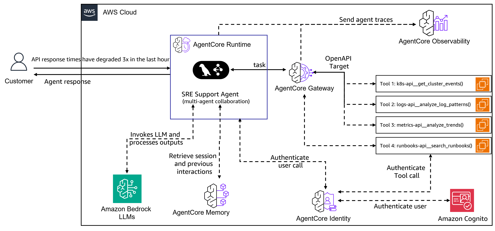

# SRE Agent - Multi-Agent Site Reliability Engineering Assistant

## Overview

The SRE Agent is a multi-agent system for Site Reliability Engineers that helps investigate infrastructure issues. Built on the Model Context Protocol (MCP) and powered by Amazon Nova and Anthropic Claude models (Claude can be accessed through Amazon Bedrock or directly through Anthropic), this system uses specialized AI agents that collaborate to investigate issues, analyze logs, monitor performance metrics, and execute operational procedures. The AgentCore Gateway provides access to data sources and systems available as MCP tools. This example also demonstrates how to deploy the agent using the Amazon Bedrock AgentCore Runtime for production environments.

### Use case details
| Information         | Details                                                                                                                             |
|---------------------|-------------------------------------------------------------------------------------------------------------------------------------|
| Use case type       | conversational                                                                                                                      |
| Agent type          | Multi-agent                                                                                                                         |
| Use case components | Tools (MCP-based), observability (logs, metrics), operational runbooks                                                             |
| Use case vertical   | DevOps/SRE                                                                                                                          |
| Example complexity  | Advanced                                                                                                                            |
| SDK used            | Amazon Bedrock AgentCore SDK, LangGraph, MCP                                                                                       |

### Use case Architecture 



### Use case key Features

- **Multi-Agent Orchestration**: Specialized agents collaborate on infrastructure investigations with real-time streaming
- **Conversational Interface**: Single-query investigations and interactive multi-turn conversations with context preservation
- **MCP-based Integration**: AgentCore Gateway provides secure API access with authentication and health monitoring
- **Specialized Agents**: Four domain-specific agents for Kubernetes, logs, metrics, and operational procedures
- **Documentation and Reporting**: Markdown reports generated for each investigation with audit trail

## Detailed Documentation

For comprehensive information about the SRE Agent system, please refer to the following detailed documentation:

- **[System Components](docs/system-components.md)** - In-depth architecture and component explanations
- **[Specialized Agents](docs/specialized-agents.md)** - Detailed capabilities of each of the four specialized agents
- **[Configuration](docs/configuration.md)** - Complete configuration guides for environment variables, agents, and gateway
- **[Security](docs/security.md)** - Security best practices and considerations for production deployment
- **[Demo Environment](docs/demo-environment.md)** - Demo scenarios, data customization, and testing setup
- **[Example Use Cases](docs/example-use-cases.md)** - Detailed walkthroughs and interactive troubleshooting examples
- **[Verification](docs/verification.md)** - Ground truth verification and report validation
- **[Development](docs/development.md)** - Testing, code quality, and contribution guidelines
- **[Deployment Guide](docs/deployment-guide.md)** - Complete deployment guide for Amazon Bedrock AgentCore Runtime

## Prerequisites

| Requirement | Description |
|-------------|-------------|
| Python 3.12+ and `uv` | Python runtime and package manager. See [use-case setup](#use-case-setup) |
| Amazon EC2 Instance | Recommended: `t3.xlarge` or larger |
| Valid SSL certificates | **⚠️ IMPORTANT:** Amazon Bedrock AgentCore Gateway **only works with HTTPS endpoints**. For example, you can register your Amazon EC2 with [no-ip.com](https://www.noip.com/) and obtain a certificate from [letsencrypt.org](https://letsencrypt.org/), or use any other domain registration and SSL certificate provider. You'll need the domain name as `BACKEND_DOMAIN` and certificate paths in the [use-case setup](#use-case-setup) section |
| EC2 instance port configuration | Required inbound ports (443, 8011-8014). See [EC2 instance port configuration](docs/ec2-port-configuration.md) |
| IAM role with BedrockAgentCoreFullAccess policy | Required permissions and trust policy for AgentCore service. See [IAM role with BedrockAgentCoreFullAccess policy](docs/auth.md) |
| Identity Provider (IDP) | Amazon Cognito, Auth0, or Okta for JWT authentication. For automated Cognito setup, use `deployment/setup_cognito.sh`. See [Authentication setup](docs/auth.md#identity-provider-configuration) |

> **Note:** All prerequisites must be completed before proceeding to the use case setup. The setup will fail without proper SSL certificates, IAM permissions, and identity provider configuration.

## Use case setup

```bash
# Clone the repository
git clone https://github.com/awslabs/amazon-bedrock-agentcore-samples
cd amazon-bedrock-agentcore-samples/02-use-cases/SRE-agent

# Create and activate a virtual environment
uv venv --python 3.12
source .venv/bin/activate  # On Windows: .venv\Scripts\activate

# Install the SRE Agent and dependencies
uv pip install -e .

# Configure environment variables
cp .env.example sre_agent/.env
# Edit sre_agent/.env and add your Anthropic API key:
# ANTHROPIC_API_KEY=sk-ant-your-key-here

# Openapi Templates get replaced with your backend domain and saved as .yaml
BACKEND_DOMAIN=api.mycompany.com ./backend/openapi_specs/generate_specs.sh

# Get your EC2 instance private IP for server binding
TOKEN=$(curl -X PUT "http://169.254.169.254/latest/api/token" \
  -H "X-aws-ec2-metadata-token-ttl-seconds: 21600" -s)
PRIVATE_IP=$(curl -H "X-aws-ec2-metadata-token: $TOKEN" \
  -s http://169.254.169.254/latest/meta-data/local-ipv4)

# Start the demo backend servers with SSL
cd backend
./scripts/start_demo_backend.sh \
  --host $PRIVATE_IP  \
  --ssl-keyfile /etc/ssl/private/privkey.pem \
  --ssl-certfile /etc/ssl/certs/fullchain.pem
cd ..

# Create and configure the AgentCore Gateway
cd gateway
./create_gateway.sh
./mcp_cmds.sh
cd ..

# Update the gateway URI in agent configuration
GATEWAY_URI=$(cat gateway/.gateway_uri)
sed -i "s|uri: \".*\"|uri: \"$GATEWAY_URI\"|" sre_agent/config/agent_config.yaml

# Copy the gateway access token to your .env file
sed -i '/^GATEWAY_ACCESS_TOKEN=/d' sre_agent/.env
echo "GATEWAY_ACCESS_TOKEN=$(cat gateway/.access_token)" >> sre_agent/.env
```

## Execution instructions

### Single Query Mode
```bash
# Investigate specific pod issues
sre-agent --prompt "Why are the payment-service pods crash looping?"

# Analyze performance degradation
sre-agent --prompt "Investigate high latency in the API gateway over the last hour"

# Search for error patterns
sre-agent --prompt "Find all database connection errors in the last 24 hours"
```

### Interactive Mode
```bash
# Start interactive conversation
sre-agent --interactive

# Available commands in interactive mode:
# /help     - Show available commands
# /agents   - List available specialist agents
# /history  - Show conversation history
# /save     - Save the current conversation
# /clear    - Clear conversation history
# /exit     - Exit the interactive session
```

#### Advanced Options
```bash
# Use Amazon Bedrock
sre-agent --provider bedrock --query "Check cluster health"

# Save investigation reports to custom directory
sre-agent --output-dir ./investigations --query "Analyze memory usage trends"

# Use Amazon Bedrock with specific profile
AWS_PROFILE=production sre-agent --provider bedrock --interactive
```

## Development to Production Deployment Flow

The SRE Agent follows a structured deployment process from local development to production on Amazon Bedrock AgentCore Runtime. For detailed instructions, see the **[Deployment Guide](docs/deployment-guide.md)**.

```
STEP 1: LOCAL DEVELOPMENT
┌─────────────────────────────────────────────────────────────────────┐
│  Develop Python Package (sre_agent/)                                │
│  └─> Test locally with CLI: uv run sre-agent --prompt "..."         │
│      └─> Agent connects to AgentCore Gateway via MCP protocol       │
└─────────────────────────────────────────────────────────────────────┘
                                    ↓
STEP 2: CONTAINERIZATION  
┌─────────────────────────────────────────────────────────────────────┐
│  Add agent_runtime.py (FastAPI server wrapper)                      │
│  └─> Create Dockerfile (ARM64 for AgentCore)                        │
│      └─> Uses deployment/build_and_deploy.sh script                 │
└─────────────────────────────────────────────────────────────────────┘
                                    ↓
STEP 3: LOCAL CONTAINER TESTING
┌─────────────────────────────────────────────────────────────────────┐
│  Build: LOCAL_BUILD=true ./deployment/build_and_deploy.sh           │
│  └─> Run: docker run -p 8080:8080 sre_agent:latest                  │
│      └─> Test: curl -X POST http://localhost:8080/invocations       │
│          └─> Container connects to same AgentCore Gateway           │
└─────────────────────────────────────────────────────────────────────┘
                                    ↓
STEP 4: PRODUCTION DEPLOYMENT
┌─────────────────────────────────────────────────────────────────────┐
│  Build & Push: ./deployment/build_and_deploy.sh                     │
│  └─> Pushes container to Amazon ECR                                 │
│      └─> deployment/deploy_agent_runtime.py deploys to AgentCore    │
│          └─> Test: uv run python deployment/invoke_agent_runtime.py │
│              └─> Production agent uses production Gateway           │
└─────────────────────────────────────────────────────────────────────┘

Key Points:
• Core agent code (sre_agent/) remains unchanged
• Deployment/ folder contains all deployment-specific utilities
• Same agent works locally and in production via environment config
• AgentCore Gateway provides MCP tools access at all stages
```

## Deploying Your Agent on Amazon Bedrock AgentCore Runtime

For production deployments, you can deploy the SRE Agent directly to Amazon Bedrock AgentCore Runtime. This provides a scalable, managed environment for running your agent with enterprise-grade security and monitoring.

The AgentCore Runtime deployment supports:
- **Container-based deployment** with automatic scaling
- **Multiple LLM providers** (Amazon Bedrock or Anthropic Claude)
- **Debug mode** for troubleshooting and development
- **Environment-based configuration** for different deployment stages
- **Secure credential management** through AWS IAM and environment variables

For complete step-by-step instructions including local testing, container building, and production deployment, see the **[Deployment Guide](docs/deployment-guide.md)**.

## Clean up instructions

```bash
# Stop all demo servers
cd backend
./scripts/stop_demo_backend.sh
cd ..

# Remove virtual environment
deactivate
rm -rf .venv

# Clean up generated files
rm -rf reports/
rm -rf gateway/.gateway_uri gateway/.access_token
rm -rf sre_agent/.env
```

## Disclaimer
The examples provided in this repository are for experimental and educational purposes only. They demonstrate concepts and techniques but are not intended for direct use in production environments. Make sure to have Amazon Bedrock Guardrails in place to protect against [prompt injection](https://docs.aws.amazon.com/bedrock/latest/userguide/prompt-injection.html).

**Important Note**: The data in [`backend/data`](backend/data) is synthetically generated, and the backend directory contains stub servers that showcase how a real SRE agent backend could work. In a production environment, these implementations would need to be replaced with real implementations that connect to actual systems, use vector databases, and integrate with other data sources.