# Building Multi-Agent Site Reliability Engineering Assistants with Amazon Bedrock AgentCore

by Amit Arora, Dheeraj Oruganty | 25 JUL 2025 in Amazon Bedrock, Amazon Bedrock Agents, Amazon Bedrock Knowledge Bases, Amazon Machine Learning, Artificial Intelligence, Generative AI

Site Reliability Engineers (SREs) face an increasingly complex challenge in modern distributed systems. During production incidents, they must rapidly correlate data from multiple sources—logs, metrics, Kubernetes events, and operational runbooks—to identify root causes and implement solutions. Traditional monitoring tools provide raw data but lack the intelligence to synthesize information across these diverse systems, often leaving SREs to manually piece together the story behind system failures.

Imagine being able to ask your infrastructure questions in natural language: ***"Why are the payment-service pods crash looping?"*** or ***"What's causing the API latency spike?"*** and receiving comprehensive, actionable insights that combine infrastructure status, log analysis, performance metrics, and step-by-step remediation procedures. This capability transforms incident response from a manual, time-intensive process into an intelligent, collaborative investigation.

In this post, we demonstrate how to build a multi-agent SRE assistant using [Amazon Bedrock AgentCore](https://docs.aws.amazon.com/bedrock-agentcore/latest/devguide/what-is-bedrock-agentcore.html), [LangGraph](https://langchain-ai.github.io/langgraph/), and the [Model Context Protocol (MCP)](https://modelcontextprotocol.io). This system deploys specialized AI agents that collaborate to provide the deep, contextual intelligence that modern SRE teams need for effective incident response and infrastructure management. We'll walk you through the complete implementation, from setting up the demo environment to deploying on Amazon Bedrock AgentCore Runtime for production use.

## Solution overview

This solution presents a comprehensive multi-agent architecture that addresses the challenges of modern SRE operations through intelligent automation. The system consists of four specialized AI agents working together under a supervisor agent to provide comprehensive infrastructure analysis and incident response assistance.

> **Note on Demo Environment**: The examples in this post use synthetically generated data from our demo environment. The backend servers simulate realistic Kubernetes clusters, application logs, performance metrics, and operational runbooks. In production deployments, these stub servers would be replaced with connections to your actual infrastructure systems, monitoring platforms, and documentation repositories.

The architecture demonstrates several key capabilities:

- **Natural language infrastructure queries** – Ask complex questions about your infrastructure in plain English and receive detailed analysis combining data from multiple sources
- **Multi-agent collaboration** – Specialized agents for Kubernetes, logs, metrics, and operational procedures work together to provide comprehensive insights
- **Real-time data synthesis** – Agents access live infrastructure data through standardized APIs and present correlated findings
- **Automated runbook execution** – Retrieve and display step-by-step operational procedures for common incident scenarios
- **Source attribution** – Every finding includes explicit source attribution for verification and audit purposes

The following diagram illustrates the solution architecture:

```mermaid
graph TB
    subgraph "User Interface"
        U["🧑‍💻 SRE Engineer"]
        CLI["Command Line Interface"]
        U -->|"Natural Language Query"| CLI
    end

    subgraph "SRE Agent Core"
        SUP["🧭 Supervisor Agent<br/>Orchestration & Routing"]
        K8S["☸️ Kubernetes Agent<br/>Infrastructure Operations"]
        LOG["📊 Logs Agent<br/>Log Analysis & Search"]
        MET["📈 Metrics Agent<br/>Performance Monitoring"]
        RUN["📖 Runbooks Agent<br/>Operational Procedures"]
        
        CLI -->|"Query"| SUP
        SUP -->|"Route"| K8S
        SUP -->|"Route"| LOG
        SUP -->|"Route"| MET
        SUP -->|"Route"| RUN
    end

    subgraph "AgentCore Gateway"
        GW["🌉 AgentCore Gateway<br/>MCP Protocol Handler"]
        AUTH["🔐 Authentication<br/>Token Management"]
        HEALTH["❤️ Health Monitor<br/>Circuit Breaker"]
        
        subgraph "Infrastructure APIs"
            DK8S["Kubernetes API<br/>:8011"]
            DLOG["Logs API<br/>:8012"]
            DMET["Metrics API<br/>:8013"]
            DRUN["Runbooks API<br/>:8014"]
        end
        
        K8S -.->|"MCP"| GW
        LOG -.->|"MCP"| GW
        MET -.->|"MCP"| GW
        RUN -.->|"MCP"| GW
        
        GW --> AUTH
        GW --> HEALTH
        GW --> DK8S
        GW --> DLOG
        GW --> DMET
        GW --> DRUN
    end

    subgraph "Amazon Bedrock"
        CLAUDE["Claude 4 Sonnet<br/>Large Language Model"]
        SUP -.->|"LLM Calls"| CLAUDE
        K8S -.->|"LLM Calls"| CLAUDE
        LOG -.->|"LLM Calls"| CLAUDE
        MET -.->|"LLM Calls"| CLAUDE
        RUN -.->|"LLM Calls"| CLAUDE
    end

    classDef agent fill:#e1f5fe,stroke:#01579b,stroke-width:2px
    classDef gateway fill:#f3e5f5,stroke:#4a148c,stroke-width:2px
    classDef api fill:#e8f5e9,stroke:#1b5e20,stroke-width:2px
    classDef bedrock fill:#fff3e0,stroke:#e65100,stroke-width:2px
    
    class SUP,K8S,LOG,MET,RUN agent
    class GW,AUTH,HEALTH gateway
    class DK8S,DLOG,DMET,DRUN api
    class CLAUDE bedrock
```



### Architecture components

The multi-agent system uses a supervisor-agent pattern where a central orchestrator coordinates four specialized agents:

**Supervisor Agent**: Analyzes incoming queries and creates investigation plans, routing work to appropriate specialists and aggregating results into comprehensive reports.

**Kubernetes Infrastructure Agent**: Handles container orchestration and cluster operations, investigating pod failures, deployment issues, resource constraints, and cluster events.

**Application Logs Agent**: Processes log data to find relevant information, identifies patterns and anomalies, and correlates events across multiple services.

**Performance Metrics Agent**: Monitors system metrics and identifies performance issues, providing both real-time analysis and historical trending.

**Operational Runbooks Agent**: Provides access to documented procedures, troubleshooting guides, and escalation procedures based on the current situation.

### Leveraging Amazon Bedrock AgentCore Primitives

The system showcases the power of Amazon Bedrock AgentCore by utilizing multiple core primitives:

**AgentCore Gateway**: The centerpiece that converts any backend API into MCP (Model Context Protocol) tools. This enables agents built with any open-source framework supporting MCP (like LangGraph in our case) to seamlessly access infrastructure APIs.

**AgentCore Identity**: Provides comprehensive security for the entire system:
- **Ingress Authentication**: Secure access control for agents connecting to the Gateway
- **Egress Authentication**: Manages authentication with backend servers, ensuring secure API access without hardcoding credentials

**AgentCore Runtime**: Provides the serverless execution environment for deploying agents at scale. The Runtime offers automatic scaling from zero to thousands of concurrent sessions while maintaining complete session isolation. Authentication and authorization to agents deployed on AgentCore Runtime is handled by AWS IAM - applications invoking the agent must have appropriate IAM permissions and trust policies. Learn more about [AgentCore security and IAM configuration](https://docs.aws.amazon.com/bedrock-agentcore/latest/devguide/security-iam.html).

**Foundation Models**: The system supports two providers for the Claude language models:
- **Amazon Bedrock**: Claude 3.7 Sonnet (us.anthropic.claude-3-7-sonnet-20250219-v1:0) for AWS-integrated deployments
- **Anthropic Direct**: Claude 4 Sonnet (claude-sonnet-4-20250514) for direct API access

### Development to Production Flow

The SRE Agent follows a structured deployment process from local development to production:

```
STEP 1: LOCAL DEVELOPMENT
┌─────────────────────────────────────────────────────────────────────┐
│  Develop Python Package (sre_agent/)                                │
│  └─> Test locally with CLI: uv run sre-agent --prompt "..."         │
│      └─> Agent connects to AgentCore Gateway via MCP protocol       │
└─────────────────────────────────────────────────────────────────────┘
                                    ↓
STEP 2: CONTAINERIZATION  
┌─────────────────────────────────────────────────────────────────────┐
│  Add agent_runtime.py (FastAPI server wrapper)                      │
│  └─> Create Dockerfile (ARM64 for AgentCore)                        │
│      └─> Uses deployment/build_and_deploy.sh script                 │
└─────────────────────────────────────────────────────────────────────┘
                                    ↓
STEP 3: LOCAL CONTAINER TESTING
┌─────────────────────────────────────────────────────────────────────┐
│  Build: LOCAL_BUILD=true ./deployment/build_and_deploy.sh           │
│  └─> Run: docker run -p 8080:8080 sre_agent:latest                  │
│      └─> Test: curl -X POST http://localhost:8080/invocations       │
│          └─> Container connects to same AgentCore Gateway           │
└─────────────────────────────────────────────────────────────────────┘
                                    ↓
STEP 4: PRODUCTION DEPLOYMENT
┌─────────────────────────────────────────────────────────────────────┐
│  Build & Push: ./deployment/build_and_deploy.sh                     │
│  └─> Pushes container to Amazon ECR                                 │
│      └─> deployment/deploy_agent_runtime.py deploys to AgentCore    │
│          └─> Test: uv run python deployment/invoke_agent_runtime.py │
│              └─> Production agent uses production Gateway           │
└─────────────────────────────────────────────────────────────────────┘

Key Points:
• Core agent code (sre_agent/) remains unchanged
• Deployment/ folder contains all deployment-specific utilities
• Same agent works locally and in production via environment config
• AgentCore Gateway provides MCP tools access at all stages
```

## Prerequisites

To implement this solution, you need the following:

* **Python 3.12 or later** with the `uv` package manager for Python dependency management
* **AWS account** with appropriate permissions to create resources
* **EC2 instance** (recommended: `t3.xlarge` or larger) for hosting the demo backend servers and as the development machine for building this solution
* **SSL certificates** for HTTPS endpoints (required by Amazon Bedrock AgentCore Gateway)
* **API credentials** for either:
  * Anthropic API key for direct Claude model access, OR
  * AWS credentials configured for Amazon Bedrock access
* **Model access** enabled in Amazon Bedrock for Claude models (Claude 3.7 Sonnet)

## Implementation walkthrough

In this section, we focus on how AgentCore Gateway and Runtime help us build this multi-agent collaboration system and deploy it end-to-end with MCP support to communicate with backend systems. The step-by-step guidance to run this solution is found in the README and other documentation - here we provide a bullet point overview of what those steps entail:

- **Clone and setup**: Repository cloning, virtual environment creation, and dependency installation
- **Environment configuration**: Setting up API keys, LLM providers, and deployment configurations  
- **Backend APIs deployment**: Starting demo infrastructure APIs with SSL certificates
- **AgentCore Gateway setup**: Creating the gateway, identity providers, and MCP tool access
- **Agent configuration**: Defining agent-to-tool mappings and system behavior
- **Multi-agent system initialization**: Setting up LangGraph workflow and agent coordination
- **Testing and validation**: Running CLI tests and validating end-to-end functionality
- **Containerization**: Building ARM64 Docker images for AgentCore Runtime compatibility
- **Production deployment**: Deploying containers to AgentCore Runtime with proper IAM configuration

Detailed instructions for each step are provided in the repository:
- [Use Case Setup Guide](https://github.com/awslabs/amazon-bedrock-agentcore-samples/tree/feature/issue-143-deploy-sre-agent-agentcore-runtime/02-use-cases/SRE-agent#use-case-setup) - Backend deployment and development setup
- [Deployment Guide](https://github.com/awslabs/amazon-bedrock-agentcore-samples/blob/feature/issue-143-deploy-sre-agent-agentcore-runtime/02-use-cases/SRE-agent/docs/deployment-guide.md) - Production containerization and AgentCore Runtime deployment

### Converting APIs to MCP Tools with AgentCore Gateway

Amazon Bedrock AgentCore Gateway demonstrates the power of protocol standardization by converting existing backend APIs into MCP (Model Context Protocol) tools that any agent framework can consume. This transformation happens seamlessly, requiring only OpenAPI specifications.

#### Step 1: Upload OpenAPI specifications

The gateway process begins by uploading your existing API specifications to S3. The [create_gateway.sh](https://github.com/awslabs/amazon-bedrock-agentcore-samples/blob/feature/issue-143-deploy-sre-agent-agentcore-runtime/02-use-cases/SRE-agent/gateway/create_gateway.sh) script automatically handles uploading the four API specifications (Kubernetes, Logs, Metrics, and Runbooks) to your configured S3 bucket with proper metadata and content types.

#### Step 2: Create identity provider and gateway

Authentication is handled seamlessly through AgentCore Identity. The [main.py](https://github.com/awslabs/amazon-bedrock-agentcore-samples/blob/feature/issue-143-deploy-sre-agent-agentcore-runtime/02-use-cases/SRE-agent/gateway/main.py) script creates both the credential provider and gateway:

```python
# Create AgentCore Gateway with JWT authorization
def create_gateway(
    client: Any,
    gateway_name: str,
    role_arn: str,
    discovery_url: str,
    allowed_clients: list = None,
    description: str = "AgentCore Gateway created via SDK",
    search_type: str = "SEMANTIC",
    protocol_version: str = "2025-03-26",
) -> Dict[str, Any]:
    
    # Build auth config for Cognito
    auth_config = {"customJWTAuthorizer": {"discoveryUrl": discovery_url}}
    if allowed_clients:
        auth_config["customJWTAuthorizer"]["allowedClients"] = allowed_clients
    
    protocol_configuration = {
        "mcp": {"searchType": search_type, "supportedVersions": [protocol_version]}
    }

    response = client.create_gateway(
        name=gateway_name,
        roleArn=role_arn,
        protocolType="MCP",
        authorizerType="CUSTOM_JWT",
        authorizerConfiguration=auth_config,
        protocolConfiguration=protocol_configuration,
        description=description,
        exceptionLevel='DEBUG'
    )
    return response
```

#### Step 3: Deploy S3 targets with credential providers

Each API becomes an MCP target through the gateway. The system automatically handles credential management:

```python
def create_s3_target(
    client: Any,
    gateway_id: str,
    s3_uri: str,
    provider_arn: str,
    target_name_prefix: str = "open",
    description: str = "S3 target for OpenAPI schema",
) -> Dict[str, Any]:
    
    s3_target_config = {"mcp": {"openApiSchema": {"s3": {"uri": s3_uri}}}}

    # API key credential provider configuration
    credential_config = {
        "credentialProviderType": "API_KEY",
        "credentialProvider": {
            "apiKeyCredentialProvider": {
                "providerArn": provider_arn,
                "credentialLocation": "HEADER",
                "credentialParameterName": "X-API-KEY",
            }
        },
    }
    
    response = client.create_gateway_target(
        gatewayIdentifier=gateway_id,
        name=target_name_prefix,
        description=description,
        targetConfiguration=s3_target_config,
        credentialProviderConfigurations=[credential_config],
    )
    return response
```

#### Result: MCP Tools Ready for Any Agent Framework

Once deployed, the AgentCore Gateway provides a standardized `/mcp` endpoint secured with JWT tokens. Testing the deployment with [mcp_cmds.sh](https://github.com/awslabs/amazon-bedrock-agentcore-samples/blob/feature/issue-143-deploy-sre-agent-agentcore-runtime/02-use-cases/SRE-agent/gateway/mcp_cmds.sh) reveals the power of this transformation:

```bash
🔧 Tool Summary:
================
📊 Total Tools Found: 21

📝 Tool Names:
   • x_amz_bedrock_agentcore_search
   • k8s-api___get_cluster_events
   • k8s-api___get_deployment_status
   • k8s-api___get_node_status
   • k8s-api___get_pod_status
   • k8s-api___get_resource_usage
   • logs-api___analyze_log_patterns
   • logs-api___count_log_events
   • logs-api___get_error_logs
   • logs-api___get_recent_logs
   • logs-api___search_logs
   • metrics-api___analyze_trends
   • metrics-api___get_availability_metrics
   • metrics-api___get_error_rates
   • metrics-api___get_performance_metrics
   • metrics-api___get_resource_metrics
   • runbooks-api___get_common_resolutions
   • runbooks-api___get_escalation_procedures
   • runbooks-api___get_incident_playbook
   • runbooks-api___get_troubleshooting_guide
   • runbooks-api___search_runbooks
```

#### Universal Agent Framework Compatibility

This MCP-standardized gateway can now be configured as a streamable HTTP server for any MCP client, including:

- **[AWS Strands](https://docs.aws.amazon.com/strands/)**: Amazon's agent development framework
- **[LangGraph](https://langchain-ai.github.io/langgraph/)**: The framework used in our SRE Agent implementation  
- **[CrewAI](https://github.com/joaomdmoura/crewAI)**: Multi-agent collaboration framework

The advantage of this approach is that existing APIs require no modification—only OpenAPI specifications. AgentCore Gateway handles:
- **Protocol Translation**: REST APIs ↔ MCP Protocol
- **Authentication**: JWT token validation and credential injection
- **Security**: TLS termination and access control
- **Standardization**: Consistent tool naming and parameter handling

This means you can take any existing infrastructure API (Kubernetes, monitoring, logging, documentation) and instantly make it available to any AI agent framework that supports MCP—all through a single, secure, standardized interface.


### Deploying to production with Amazon Bedrock AgentCore Runtime

Amazon Bedrock AgentCore makes it remarkably simple to deploy existing agents to production. The process involves three key steps: containerizing your agent, deploying to AgentCore Runtime, and invoking the deployed agent.

#### Step 1: Containerize your agent

AgentCore Runtime requires ARM64 containers. Here's the complete [Dockerfile](https://github.com/awslabs/amazon-bedrock-agentcore-samples/blob/feature/issue-143-deploy-sre-agent-agentcore-runtime/02-use-cases/SRE-agent/Dockerfile):

```dockerfile
# Use uv's ARM64 Python base image
FROM --platform=linux/arm64 ghcr.io/astral-sh/uv:python3.12-bookworm-slim

WORKDIR /app

# Copy and install dependencies
COPY pyproject.toml uv.lock ./
RUN uv sync --frozen --no-dev

# Copy SRE agent module
COPY sre_agent/ ./sre_agent/

# Set environment variables
ENV PYTHONPATH="/app" \
    PYTHONDONTWRITEBYTECODE=1 \
    PYTHONUNBUFFERED=1

EXPOSE 8080

# Run application
CMD ["uv", "run", "uvicorn", "sre_agent.agent_runtime:app", "--host", "0.0.0.0", "--port", "8080"]
```

The key insight: any existing agent just needs a FastAPI wrapper (`agent_runtime:app`) to become AgentCore-compatible.

#### Step 2: Deploy to AgentCore Runtime

Deploying to AgentCore Runtime is surprisingly straightforward with the [deploy_agent_runtime.py](https://github.com/awslabs/amazon-bedrock-agentcore-samples/blob/feature/issue-143-deploy-sre-agent-agentcore-runtime/02-use-cases/SRE-agent/deployment/deploy_agent_runtime.py) script:

```python
import boto3

# Create AgentCore client
client = boto3.client('bedrock-agentcore', region_name=region)

# Environment variables for your agent
env_vars = {
    'GATEWAY_ACCESS_TOKEN': gateway_access_token,
    'LLM_PROVIDER': llm_provider,
    'ANTHROPIC_API_KEY': anthropic_api_key  # if using Anthropic
}

# Deploy container to AgentCore Runtime
response = client.create_agent_runtime(
    agentRuntimeName=runtime_name,
    agentRuntimeArtifact={
        'containerConfiguration': {
            'containerUri': container_uri  # Your ECR container URI
        }
    },
    networkConfiguration={"networkMode": "PUBLIC"},
    roleArn=role_arn,
    environmentVariables=env_vars
)

print(f"Agent Runtime ARN: {response['agentRuntimeArn']}")
```

That's it! AgentCore handles all the infrastructure, scaling, and session management automatically.

#### Step 3: Invoke your deployed agent

Calling your deployed agent is just as simple with [invoke_agent_runtime.py](https://github.com/awslabs/amazon-bedrock-agentcore-samples/blob/feature/issue-143-deploy-sre-agent-agentcore-runtime/02-use-cases/SRE-agent/deployment/invoke_agent_runtime.py):

```python
import boto3
import json

# Create AgentCore client
agent_core_client = boto3.client('bedrock-agentcore', region_name=region)

# Prepare your query
payload = json.dumps({
    "input": {"prompt": "API response times have degraded 3x in the last hour"}
})

# Invoke the deployed agent
response = agent_core_client.invoke_agent_runtime(
    agentRuntimeArn=runtime_arn,
    runtimeSessionId=session_id,
    payload=payload,
    qualifier="DEFAULT"
)

# Get the response
response_data = json.loads(response['response'].read())
print(response_data["output"]["message"])
```

#### Key benefits of AgentCore Runtime

- **Zero infrastructure management**: No servers, load balancers, or scaling to configure
- **Built-in session isolation**: Each conversation is completely isolated
- **AWS IAM integration**: Secure access control without custom authentication
- **Automatic scaling**: Scales from zero to thousands of concurrent sessions

The complete deployment process, including building containers and handling AWS permissions, is documented in the [Deployment Guide](https://github.com/awslabs/amazon-bedrock-agentcore-samples/blob/feature/issue-143-deploy-sre-agent-agentcore-runtime/02-use-cases/SRE-agent/docs/deployment-guide.md).


## Real-world use cases

Let's explore how the SRE Agent handles common incident response scenarios with a real investigation.

### Investigating API performance degradation

When facing a production issue, you can query the system in natural language:

```bash
sre-agent --prompt "API response times have degraded 3x in the last hour"
```

The supervisor analyzes the query and creates an investigation plan:

```
📋 Investigation Plan:
1. Check current performance metrics and response time trends to quantify the degradation
2. Analyze application logs for errors or warnings that correlate with the performance drop
3. Review resource utilization metrics to identify potential bottlenecks

Complexity: Simple - Auto-executing investigation...
```

**Performance Metrics Agent Response:**
```
## Performance Metrics Analysis Summary

Based on my investigation, I've identified a **critical performance degradation** affecting your API response times:

### Response Time Degradation (source: get_performance_metrics)
- **web-service /api/users endpoint**: Response times increased from 150ms to 5000ms over 4 minutes
- **Degradation factor**: 33x increase (150ms → 5000ms), significantly exceeding the reported 3x degradation
- **Timeline**: Degradation started at 14:21:00Z and rapidly escalated
- **Sample count decline**: Requests dropped from 100 to 20 samples, indicating service degradation

### Error Rate Correlation (source: get_error_rates)
- **web-service error rates**: Escalated from 0.5% to 75% during the same timeframe
- **Error pattern**: Predominantly server errors (500: 120, 503: 28 at 14:24:00Z)
- **Request volume**: Dropped from 1000 to 200 requests as performance degraded

### Resource Utilization Critical Issues (source: get_resource_metrics)
- **CPU usage**: Escalation from 25% to 95% on web-service
- **Memory usage**: Reached 100% utilization (1024MB) at 14:24:00Z
- **Resource exhaustion**: Both CPU and memory at critical levels

### Root Cause Analysis
The primary issue appears to be **database connectivity problems**:
- **database service**: 100% error rate with "ConfigMap not found" and "Permission denied on data directory" failures
- **Connection refused errors**: 1440+ connection attempts failing consistently
```

**Application Logs Agent Response:**
```
## Log Analysis Summary

Based on my analysis of the application logs, I've identified the root causes:

### Primary Issues Identified

#### 1. Database Connectivity Failures (source: get_error_logs)
- **Configuration Issues**: 'FATAL: could not open configuration file '/etc/postgresql/database.conf': No such file or directory' at 2024-01-15T14:22:30.123Z
- **Permission Problems**: 'FATAL: data directory '/var/lib/postgresql/data' has invalid permissions' at 2024-01-15T14:23:00.789Z
- **Missing ConfigMap**: 'ERROR: ConfigMap 'database-config' not found in namespace 'production'' at 2024-01-15T14:23:30.012Z

#### 2. Connection Timeout Pattern (source: analyze_log_patterns)
- **Pattern**: "Database connection timeout" occurring 15 times between 14:23:46.567Z and 14:24:30.789Z
- **Specific Error**: 'Database connection timeout after 5000ms' affecting /api/users endpoints

#### 3. Memory Exhaustion (source: analyze_log_patterns)
- **Critical Pattern**: "OutOfMemoryError" occurring 8 times starting at 14:24:30.789Z
- **Heap Space Issue**: 'java.lang.OutOfMemoryError: Java heap space at com.example.UserService.loadAllUsers(UserService.java:45)'
- **Application Shutdown**: 'Application shutting down due to critical error' at 2024-01-15T14:25:11.456Z

### Timeline of Events
1. **14:22:15Z**: Slow queries begin appearing (1250ms duration)
2. **14:22:30Z**: Database configuration file missing
3. **14:23:00Z**: Database permission errors and health check failures
4. **14:23:46Z**: Connection timeouts start (5000ms timeout threshold)
5. **14:24:30Z**: OutOfMemoryError begins occurring
6. **14:25:11Z**: Web service shuts down due to critical errors
```

The system aggregates these findings into an executive summary with clear next steps:

**📋 Executive Summary**

**🎯 Key Insights**
- **Root Cause**: Database service failure due to missing ConfigMap 'database-config' and invalid data directory permissions, causing cascading failures across dependent services
- **Impact**: Service instability with severe performance degradation - API response times increased 33x (150ms → 5000ms) with 75% error rates and memory exhaustion leading to web-service shutdown
- **Severity**: **Critical** - Complete database unavailability, web-service terminated, and authentication systems non-functional

**⚡ Next Steps**
1. **Immediate** (< 1 hour): Restore database ConfigMap 'database-config' in production namespace and fix data directory permissions at '/var/lib/postgresql/data'
2. **Short-term** (< 24 hours): Restart web-service pods after database recovery, investigate UserService.loadAllUsers method causing heap exhaustion
3. **Long-term** (< 1 week): Implement circuit breaker patterns to prevent cascade failures, scale web-service resources to handle memory demands
4. **Follow-up**: Monitor database connectivity patterns and establish alerts for ConfigMap availability and memory utilization thresholds

### Real-time agent execution traces

The agent.log file shows the detailed execution flow during this investigation:

```
2025-07-27 01:05:07,085 - Starting multi-agent system with provider: anthropic
2025-07-27 01:05:07,326 - Retrieved 21 tools from MCP
2025-07-27 01:05:11,735 - Created investigation plan: 3 steps, complexity: simple
2025-07-27 01:05:11,736 - Supervisor: Routing to metrics
2025-07-27 01:05:14,064 - Performance Metrics Agent - Agent making 1 tool calls
2025-07-27 01:05:14,064 - Tool call: metrics-api___get_performance_metrics
2025-07-27 01:05:16,655 - Tool call: metrics-api___analyze_trends
2025-07-27 01:05:26,196 - Tool call: metrics-api___get_error_rates
2025-07-27 01:05:29,165 - Tool call: metrics-api___get_resource_metrics (cpu)
2025-07-27 01:05:31,587 - Tool call: metrics-api___get_resource_metrics (memory)
```

This shows the real-time collaboration between agents, with the supervisor intelligently routing work to specialists based on the investigation plan. The system automatically scaled from identifying performance metrics to correlating with error rates and resource utilization.

This investigation demonstrates several key capabilities:
- **Multi-source correlation**: Connecting database configuration issues to API performance degradation
- **Real-time streaming**: Agents work in parallel while providing live updates
- **Source attribution**: Every finding includes the specific tool and data source
- **Actionable insights**: Clear timeline of events and prioritized recovery steps
- **Cascading failure detection**: Understanding how one failure propagates through the system

## Business impact

Organizations implementing AI-powered SRE assistance report significant improvements in key operational metrics:

**Faster Incident Resolution**: Initial investigations that previously took 30-45 minutes can be completed in 5-10 minutes, providing SREs with comprehensive context before diving into detailed analysis.

**Reduced Context Switching**: Instead of navigating multiple dashboards and tools, SREs can ask questions in natural language and receive aggregated insights from all relevant data sources.

**Knowledge Democratization**: Junior team members can access the same comprehensive investigation techniques as senior engineers, reducing dependency on tribal knowledge and on-call burden.

**Consistent Methodology**: The system ensures consistent investigation approaches across team members and incident types, improving overall reliability and reducing the chance of missed evidence.

**Documentation and Learning**: Automatically generated investigation reports provide valuable documentation for post-incident reviews and help teams learn from each incident.

**Seamless AWS Integration**: The system naturally extends your existing AWS infrastructure investments, working alongside services like CloudWatch, Systems Manager, and other AWS operational tools to provide a unified operational intelligence platform.

## Extending the solution

The modular architecture makes it easy to extend the system for your specific needs:

### Custom agents

Add specialized agents for your domain:

- **Security Agent**: For compliance checks and security incident response
- **Database Agent**: For database-specific troubleshooting and optimization
- **Network Agent**: For connectivity and infrastructure debugging

### Real infrastructure integration

Replace the demo APIs with connections to your actual systems:

- **Kubernetes Integration**: Connect to your cluster APIs for pod status, deployments, and events
- **Log Aggregation**: Integrate with your log management platform (Elasticsearch, Splunk, CloudWatch Logs)  
- **Metrics Platform**: Connect to your monitoring system (Prometheus, DataDog, CloudWatch Metrics)
- **Runbook Repository**: Link to your operational documentation and playbooks stored in wikis, git repositories, or knowledge bases

## Clean up

To avoid incurring future charges, complete the following steps to clean up your resources:

```bash
# Stop all demo servers
cd backend
./scripts/stop_demo_backend.sh
cd ..

# Remove virtual environment
deactivate
rm -rf .venv

# Clean up generated files
rm -rf reports/
rm -rf gateway/.gateway_uri gateway/.access_token
rm -rf sre_agent/.env
```

## Conclusion

The future of site reliability engineering lies not in replacing human expertise, but in augmenting it with AI that can rapidly synthesize information across complex distributed systems. The SRE Agent demonstrates how multi-agent systems can transform incident response from a manual, time-intensive process into an intelligent, collaborative investigation that provides SREs with the insights they need to resolve issues quickly and confidently.

By combining Amazon Bedrock AgentCore's enterprise-grade infrastructure with the Model Context Protocol's standardized tool access, we've created a foundation that can adapt as your infrastructure evolves and new capabilities emerge. AWS's comprehensive AI and machine learning services, from foundation models to serverless computing, provide the scalable, secure foundation that enterprises need for production AI deployments.

The system's modular architecture ensures that you can start with basic functionality and expand to address your organization's specific operational challenges while leveraging AWS's proven track record in mission-critical infrastructure. Whether you're dealing with midnight production incidents, conducting proactive health checks, or training new team members, AI-powered SRE assistance can help your team maintain reliable, high-performing systems while reducing the stress and toil that traditionally comes with operations work.

The complete implementation is available in our GitHub repository, including demo environments, configuration guides, and extension examples. We encourage you to explore the system, customize it for your infrastructure, and share your experiences with the community.

To get started building your own SRE assistant, refer to the following resources:

* [Amazon Bedrock AgentCore documentation](https://docs.aws.amazon.com/bedrock/latest/userguide/agents.html)
* [Model Context Protocol specification](https://modelcontextprotocol.io)
* [LangGraph framework documentation](https://langchain-ai.github.io/langgraph/)
* [SRE Agent GitHub repository](https://github.com/awslabs/amazon-bedrock-agentcore-samples)

What operational challenges will you solve with AI-powered SRE assistance? Start your journey today and experience the future of intelligent infrastructure operations.

---

### About the authors

**[Author Name]** is a [Title] at Amazon Web Services, where [brief description of role and expertise]. [Additional background and interests].

**[Author Name]** is a [Title] at Amazon Web Services, specializing in [expertise areas]. [Background and contributions].

**[Author Name]** is a [Title] at Amazon Web Services, focusing on [specialization]. [Experience and interests]. 