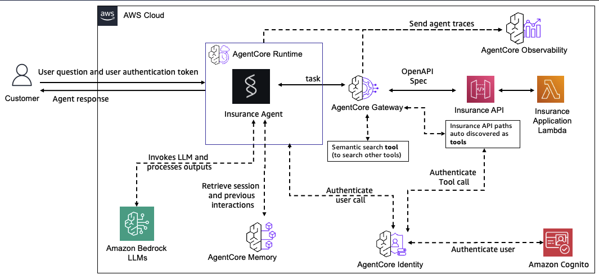

# From Prototype to Production: Agentic Applications with AWS Bedrock AgentCore
> [!CAUTION]
> This sample is for experimental and educational purposes only. They demonstrate concepts and techniques but are not intended for direct use in production environments. Make sure to have Amazon Bedrock Guardrails in place to protect against [prompt injection](https://docs.aws.amazon.com/bedrock/latest/userguide/prompt-injection.html). 

**Important:**
- This application **is not intended** for direct use in production environments.
- The code and architecture presented here are examples and may not meet all security, scalability, or compliance requirements for your specific use case.
- Before deploying any similar system in a production environment, it is crucial to:
  - Conduct thorough testing and security audits
  - Ensure compliance with all relevant regulations and industry standards
  - Optimize for your specific performance and scalability needs
  - Implement proper error handling, logging, and monitoring
  - Follow all AWS best practices for production deployments

<div align="center">
  
  
  
  
</div>

<!-- Architecture diagram is ASCII art in the Migration to Production section -->

## 🚀 Overview

This repository demonstrates how to transform a local prototype of an agentic application into a production-ready system using AWS Bedrock AgentCore. It provides a complete implementation of an auto insurance agent that helps customers get quotes, retrieve vehicle information, and manage policies.

The repository contains two parallel implementations:

- **`local_prototype/`** - A development-focused implementation using local servers and direct connections
- **`agentcore_app/`** - A production-ready implementation leveraging AWS Bedrock AgentCore services

## ✨ Key Benefits of Cloud Migration

| Local Prototype | Production with AgentCore | Benefit |
|----------------|--------------------------|---------|
| Manual authentication | OAuth2 with Cognito | 🔒 Enhanced security |
| Local logging | CloudWatch integration | 📊 Centralized monitoring |
| Manual scaling | Auto-scaling runtime | 📈 Improved performance |
| Local deployment | Containerized deployment | 🚀 Simplified operations |
| Ad-hoc testing | CI/CD integration | 🧪 Reliable quality |
| Direct API access | API Gateway + Lambda | 💰 Cost optimization |

## 🏗️ Architecture

The production architecture consists of three main components:

1. **Cloud Insurance API** - FastAPI application deployed as AWS Lambda function
2. **Cloud MCP Server** - AgentCore Gateway configuration exposing insurance API as MCP tools
3. **Cloud Strands Insurance Agent** - Strands-based agent using AgentCore Gateway

### Component Interaction Flow:

1. User sends a query to the Insurance Agent
2. Agent connects to AgentCore Gateway MCP server using OAuth authentication
3. AgentCore Gateway exposes API operations as MCP tools
4. Insurance API processes the requests and returns data
5. Agent formulates responses using LLM and tool results

## 🛠️ Technologies Used

- **AWS Bedrock AgentCore**: Managed agent runtime environment
- **AWS Lambda & API Gateway**: Serverless API hosting
- **Amazon Cognito**: Authentication and authorization
- **Strands Agents**: Agent framework with MCP integration
- **FastAPI**: Modern API framework for Python
- **CloudWatch**: Monitoring and observability

## 📚 Repository Structure

```
insurance_final/
├── local_prototype/                  # Development implementation
│   ├── insurance_api/                # Local FastAPI server
│   ├── native_mcp_server/            # Local MCP server
│   └── strands_insurance_agent/      # Local agent implementation
│
└── agentcore_app/       # Production implementation
    ├── cloud_insurance_api/          # Lambda-deployed FastAPI
    ├── cloud_mcp_server/             # AgentCore Gateway configuration
    └── cloud_strands_insurance_agent/  # Cloud agent implementation
```

## 🧪 Local Prototype

Before deploying to the cloud, you can run and test the entire application stack locally to understand its functionality and make development iterations faster.

### Architecture

The local prototype consists of three main components running on your machine:

1. **Local Insurance API** (Port 8001): FastAPI backend with insurance data and business logic
2. **Local MCP Server** (Port 8000): Model Context Protocol server exposing API endpoints as tools
3. **Local Strands Insurance Agent**: Interactive agent using Claude to process user queries

<!-- Local architecture diagram is described in text above -->

### Running the Local Prototype

Follow these steps to start the local prototype:

1. **Start the Insurance API**
   ```bash
   cd local_prototype/local_insurance_api
   python -m venv venv
   source venv/bin/activate  # On Windows: venv\Scripts\activate
   pip install -r requirements.txt
   python -m uvicorn server:app --port 8001
   ```

2. **Start the MCP Server**
   ```bash
   cd local_prototype/local_mcp_server
   python -m venv venv
   source venv/bin/activate  # On Windows: venv\Scripts\activate
   pip install -r requirements.txt
   python server.py --http
   ```

3. **Run the Strands Agent**
   ```bash
   cd local_prototype/local_strands_insurance_agent
   python -m venv venv
   source venv/bin/activate  # On Windows: venv\Scripts\activate
   pip install -r requirements.txt
   # Configure AWS credentials for Bedrock access
   # Configure credentials using (https://strandsagents.com/latest/documentation/docs/user-guide/quickstart/#configuring-credentials)
   # Start the interactive agent
   python interactive_insurance_agent.py
   ```

### Testing the Local Prototype

You can interact with the local prototype in several ways:

- **API Testing**: Access `http://localhost:8001/docs` to test API endpoints directly
- **MCP Inspector**: Run `npx @modelcontextprotocol/inspector` to inspect and test MCP tools
- **Chat Interface**: Interact with the agent through the terminal-based chat interface

### Sample Queries

```
You: What information do you have about customer cust-001?
Agent: I have information for John Smith. He is 35 years old and lives at 123 Main St, Springfield, IL.
       His email is john.smith@example.com and phone number is 555-123-4567.

You: What kind of car does he have?
Agent: John Smith owns a 2020 Toyota Camry.

You: Can you give me a quote for a 2023 Honda Civic?
Agent: Based on John Smith's profile, a 2023 Honda Civic would cost approximately $1,245 per year for comprehensive coverage.
```

For more detailed instructions and examples, see the [Local Prototype README](local_prototype/README.md).

## 🚦 Getting Started

### Prerequisites

- AWS account with Bedrock access enabled
- AWS CLI configured with appropriate permissions
- Python 3.10 or higher
- Docker Desktop or Finch installed
- Basic understanding of AWS services

## Migration to Production

This section explains how each component from the local prototype is transformed into a production-ready AWS solution using Bedrock AgentCore.

```
┌───────────────────┐      ┌───────────────────┐      ┌───────────────────┐
│                   │      │                   │      │                   │
│  Local Strands    │◄────►│  Local MCP Server │◄────►│  Local FastAPI    │
│  Agent            │      │                   │      │                   │
│                   │      │                   │      │                   │
└─────────┬─────────┘      └─────────┬─────────┘      └─────────┬─────────┘
          │                          │                          │
          ▼                          ▼                          ▼
┌───────────────────┐      ┌───────────────────┐      ┌───────────────────┐
│                   │      │                   │      │                   │
│  AgentCore        │◄────►│  AgentCore        │◄────►│  AWS Lambda +     │
│  Runtime Agent    │      │  Gateway          │      │  API Gateway      │
│                   │      │                   │      │                   │
└───────────────────┘      └───────────────────┘      └───────────────────┘
```

### 1. FastAPI to AWS Lambda with Mangum

The local FastAPI application is adapted for serverless deployment using the Mangum adapter:

- **Mangum Integration**: Acts as a bridge between AWS Lambda and ASGI applications
- **Lambda Handler**: A wrapper function that transforms API Gateway events for FastAPI processing
- **Deployment Package**: Application code bundled with dependencies for Lambda execution
- **API Gateway**: Provides HTTP endpoints and authentication for the Lambda function
- **AWS SAM Template**: Infrastructure as code defining all necessary resources

```python
# Example: lambda_function.py - How FastAPI connects to Lambda
from local_insurance_api.app import app  # Import the FastAPI app
from mangum import Mangum

# Create the Lambda handler that API Gateway will invoke
handler = Mangum(app)
```

### 2. MCP Server to AgentCore Gateway

The local MCP server is replaced by AWS Bedrock AgentCore Gateway:

- **OpenAPI Integration**: The Gateway imports API operations from OpenAPI specification
- **Tool Schema Definition**: API endpoints are converted to MCP tool schemas
- **OAuth Authentication**: Cognito integration provides secure access control
- **Managed Infrastructure**: AWS handles scaling, availability, and observability
- **Gateway Configuration**: Tool definitions maintain compatibility with agent code

```python
# Example: Gateway setup with OpenAPI specification
gateway = client.create_mcp_gateway(
    name="InsuranceAPIGateway",
    authorizer_config=cognito_response["authorizer_config"]
)

# Register API as MCP tools using OpenAPI specification
client.create_mcp_gateway_target(
    gateway=gateway,
    name="InsuranceAPITarget",
    target_type="openApiSchema",
    target_payload={"inlinePayload": json.dumps(openapi_spec)}
)
```

### 3. Strands Agent to AgentCore Runtime

The local Strands agent is deployed to AWS Bedrock AgentCore Runtime:

- **BedrockAgentCoreApp**: Wrapper for deploying Strands agents to AWS
- **Entrypoint Decoration**: Standardized interface for cloud execution
- **Container Deployment**: Packaged as Docker image for consistent execution
- **Managed Scaling**: AWS handles agent execution resources
- **Credentials Management**: Secure access to gateway and models

```python
# Example: Strands agent adapted for AgentCore
from bedrock_agentcore.runtime import BedrockAgentCoreApp

app = BedrockAgentCoreApp()

@app.entrypoint
def invoke(payload):
    user_input = payload.get("user_input")
    
    # Connect to Gateway MCP with authentication
    gateway_client = MCPClient(lambda: streamablehttp_client(
        gateway_url, 
        headers={"Authorization": f"Bearer {access_token}"}
    ))
    
    with gateway_client:
        # Standard Strands agent code continues here
        tools = gateway_client.list_tools_sync()
        agent = Agent(model="claude-3", tools=tools, system_prompt="...")
        return agent(user_input)
```

### Production Deployment Steps

Follow these steps to deploy the complete production solution:

1. **Deploy the Insurance API**
   ```bash
   cd agentcore_app/cloud_insurance_api/deployment
   ./deploy.sh
   ```
   This deploys the FastAPI application to AWS Lambda and creates an API Gateway endpoint using AWS SAM.

2. **Set up the MCP Server with AgentCore Gateway**
   ```bash
   cd ../cloud_mcp_server
   # Configure environment variables
   cp .env.example .env
   # Edit .env with your settings
   
   # Run setup script
   python agentcore_gateway_setup_openapi.py
   ```
   This creates an AgentCore Gateway that exposes your API operations as MCP tools with OAuth authentication.

3. **Deploy the Strands Insurance Agent**
   ```bash
   cd ../cloud_strands_insurance_agent
   
   # Configure environment variables
   cp .env.example .env
   # Update .env with MCP URL and token
   
   # Configure and deploy
   agentcore configure -e "agentcore_strands_insurance_agent.py" \
     --name insurance_agent_strands \
     -er <execution-role-arn>
   
   # Deploy to cloud
   agentcore launch
   ```
   This containerizes your agent and deploys it to AgentCore Runtime where it can be invoked securely.

4. **Test the Deployment**
   ```bash
   # Refresh token if needed
   cd 1_pre_req_setup/cognito_auth
   ./refresh_token.sh
   
   # Invoke agent
   agentcore invoke --bearer-token $BEARER_TOKEN \
     '{"user_input": "I need a quote for a 2023 Toyota Camry"}'
   ```

   

## 🔍 Component Details


### Cloud Insurance API

The Insurance API is built with FastAPI and deployed as a serverless application using AWS Lambda and API Gateway. It provides endpoints for querying insurance-related information.

[Learn more about the Cloud Insurance API](agentcore_app/cloud_insurance_api/README.md)

### Cloud MCP Server

The MCP Server component configures AWS Bedrock AgentCore Gateway to expose insurance API operations as MCP tools that can be used by LLM-powered agents.

[Learn more about the Cloud MCP Server](agentcore_app/cloud_mcp_server/README.md)

### Cloud Strands Insurance Agent

The Insurance Agent is built using Strands Agents framework and connects to the AgentCore Gateway to provide insurance assistance through natural language interactions.

[Learn more about the Cloud Strands Insurance Agent](agentcore_app/cloud_strands_insurance_agent/README.md)

## 🛡️ Security Considerations

- All sensitive configuration is stored in environment variables
- Authentication uses OAuth 2.0 with Cognito
- API access is secured through API keys and bearer tokens
- IAM roles follow principle of least privilege

## 📊 Monitoring and Observability

The production implementation includes:
- CloudWatch logs for all components
- X-Ray tracing for request flow
- Custom metrics for agent performance
- Error reporting and alerting

## Clean Up

When you're done using the agentcore app, follow these steps to clean up resources:

1. **Delete Gateway and Targets**:
   ```bash
   # Get gateway ID
   aws bedrock-agentcore-control list-gateways
   
   # List targets for your gateway
   aws bedrock-agentcore-control list-gateway-targets --gateway-identifier your-gateway-id
   
   # Delete targets first (if not deleting the entire gateway)
   aws bedrock-agentcore-control delete-gateway-target --gateway-identifier your-gateway-id --target-id your-target-id
   
   # Delete gateway (this will also delete all associated targets)
   aws bedrock-agentcore-control delete-gateway --gateway-identifier your-gateway-id
   ```

2. **Delete AgentCore Runtime Resources**:
   ```bash
   # List agent runtimes
   aws bedrock-agentcore-control list-agent-runtimes
   
   # List agent runtime endpoints
   aws bedrock-agentcore-control list-agent-runtime-endpoints --agent-runtime-identifier your-agent-runtime-id
   
   # Delete agent runtime endpoints
   aws bedrock-agentcore-control delete-agent-runtime-endpoint --agent-runtime-identifier your-agent-runtime-id --agent-runtime-endpoint-identifier your-endpoint-id
   
   # Delete agent runtime
   aws bedrock-agentcore-control delete-agent-runtime --agent-runtime-identifier your-agent-runtime-id
   ```

3. **Delete OAuth2 Credential Providers**:
   ```bash
   # List OAuth2 credential providers
   aws bedrock-agentcore-control list-oauth2-credential-providers
   
   # Delete OAuth2 credential provider
   aws bedrock-agentcore-control delete-oauth2-credential-provider --credential-provider-identifier your-provider-id
   ```

4. **Cognito Resources**:
   ```bash
   aws cognito-idp delete-user-pool-client --user-pool-id your-user-pool-id --client-id your-app-client-id
   aws cognito-idp delete-user-pool --user-pool-id your-user-pool-id
   ```

## 📝 License

This project is licensed under the Apache License 2.0 - see the [LICENSE](../../LICENSE) file for details.

---

<p align="center">
  Built with ❤️ using AWS Bedrock AgentCore and Strands Agents
</p>