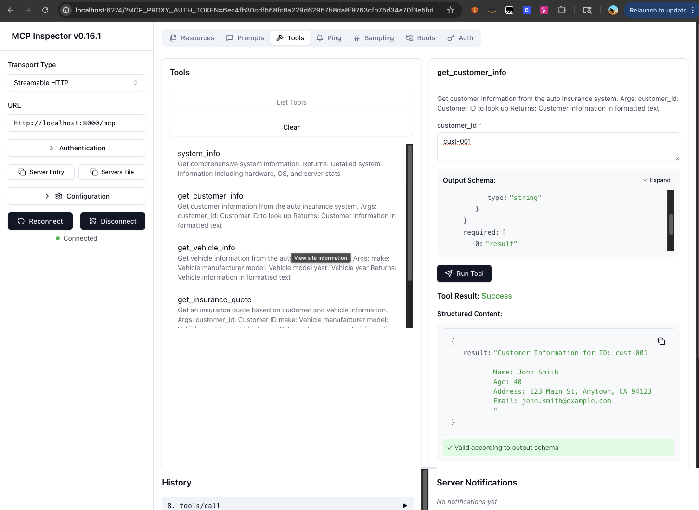

# Auto Insurance API MCP Server

This directory contains a Model Context Protocol (MCP) server that provides access to the Auto Insurance API. It allows LLMs and other applications to retrieve customer information, vehicle details, and insurance quotes through a standardized protocol.

## Overview

The MCP server acts as a bridge between LLMs (like Claude) and our Auto Insurance API. It exposes several tools that can be used to:

1. Get customer information
2. Get vehicle information
3. Get insurance quotes
4. Get vehicle safety information
5. Get policy information (all policies, specific policy, or customer policies)

## Prerequisites

- Python 3.10 or higher
- Node.js and npm (for the MCP Inspector)
- uv package manager (recommended)

## Setup Instructions

### 1. Install Dependencies

```bash
# Clone the repository if you haven't already
cd local_prototype/native_mcp_server

# Option 1: Using the setup script
chmod +x setup.sh
./setup.sh

# Option 2: Manual setup
python -m venv venv
source venv/bin/activate
pip install -r requirements.txt
```

### 2. Start the Insurance API

The MCP server connects to the Insurance API, which needs to be running on port 8001:

```bash
cd ../insurance_api
python -m uvicorn server:app --port 8001
```

### 3. Start the MCP Server

In a new terminal window:

```bash
cd local_prototype/native_mcp_server
source venv/bin/activate

# Run with uv (recommended)
uv run server.py

# Or with regular Python
python server.py
```

You should see output similar to:
```
🚀 Starting LocalMCP v1.0.0 MCP server...
📂 Projects directory: /Users/username/local_mcp_projects
🔌 Insurance API URL: http://localhost:8001
✅ Server is running. Press CTRL+C to stop.
Starting with streamable-http transport...
INFO: Uvicorn running on http://127.0.0.1:8000 (Press CTRL+C to quit)
```

### 4. Connect with the MCP Inspector

To test the server with the MCP Inspector:

1. Install and start the MCP Inspector:
```bash
npx @modelcontextprotocol/inspector
```

2. This should automatically open the MCP Inspector in your browser

3. Add the MCP server URL:
   - Click "Add MCP URL"
   - Enter: `http://localhost:8000/mcp`
   - Click "Connect"

4. You should now see the available tools and be able to interact with them:
   - `get_customer_info`
   - `get_vehicle_info`
   - `get_insurance_quote`
   - `get_vehicle_safety`
   - `get_all_policies`
   - `get_policy_by_id`
   - `get_customer_policies`

## Using the Tools

### Example: Get Customer Information

To get information about a customer:

1. In the MCP Inspector, select the `get_customer_info` tool
2. Enter a valid customer ID (e.g., `cust-001`) in the parameters
3. Click "Run"

### Example: Work with Policy Data

The MCP server provides three tools for working with insurance policies:

#### Get All Policies

To retrieve all available policies:

1. In the MCP Inspector, select the `get_all_policies` tool
2. No parameters are required
3. Click "Run"

#### Get Policy by ID

To retrieve details of a specific policy:

1. In the MCP Inspector, select the `get_policy_by_id` tool
2. Enter a valid policy ID (e.g., `policy-001`) in the parameters
3. Click "Run"

#### Get Customer's Policies

To retrieve all policies for a specific customer:

1. In the MCP Inspector, select the `get_customer_policies` tool
2. Enter a valid customer ID (e.g., `cust-001`) in the parameters
3. Click "Run"



### Valid Test Data

Use these values for testing:

- Customer IDs: `cust-001`, `cust-002`, `cust-003`
- Vehicle Makes: `Toyota`, `Honda`, `Ford`
- Vehicle Models: `Camry`, `Civic`, `F-150`
- Vehicle Years: Any year between 2010-2023
- Policy IDs: `policy-001`, `policy-002`, `policy-003`

## Troubleshooting

- **Connection refused errors**: Make sure both the Insurance API and MCP server are running
- **Missing customer errors**: Check that you're using a valid customer ID
- **Port already in use**: Kill the process using the port or specify a different port

## Architecture

The MCP server consists of:

1. `server.py` - The main entry point that initializes the MCP server
2. `tools/insurance_tools.py` - The tools that interact with the Insurance API
3. `config.py` - Configuration including API URL and server settings

## For Developers

To add more tools:

1. Add your functions to `tools/insurance_tools.py`
2. Register them in the `register_insurance_tools` function
3. Restart the server to make them available

To modify error handling:

- Edit the try/except blocks in the tool implementations to customize error messages