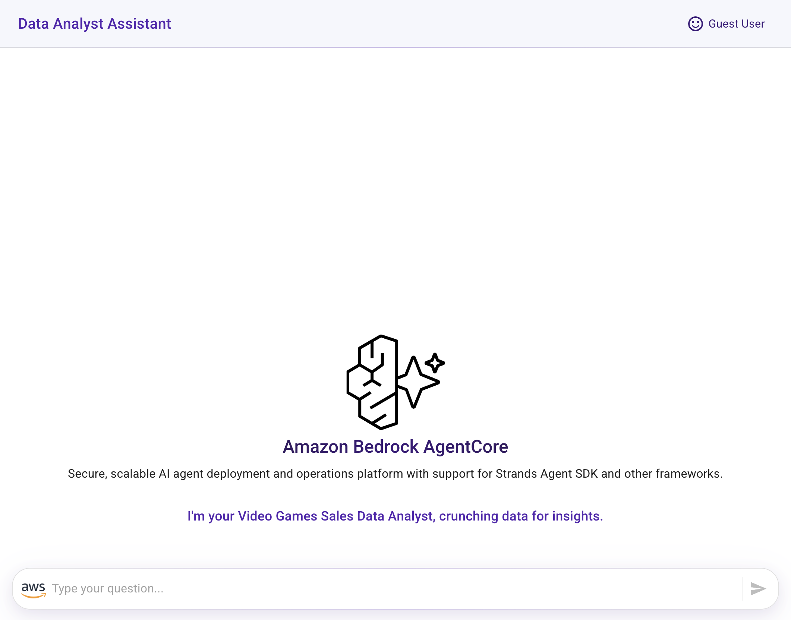
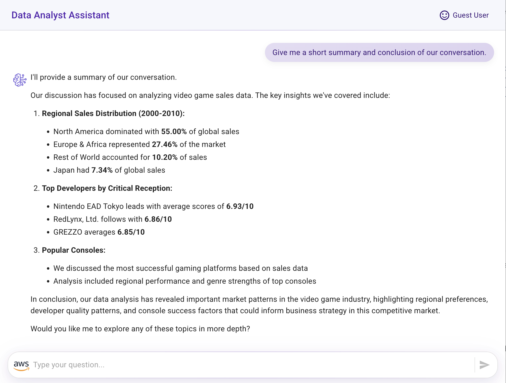
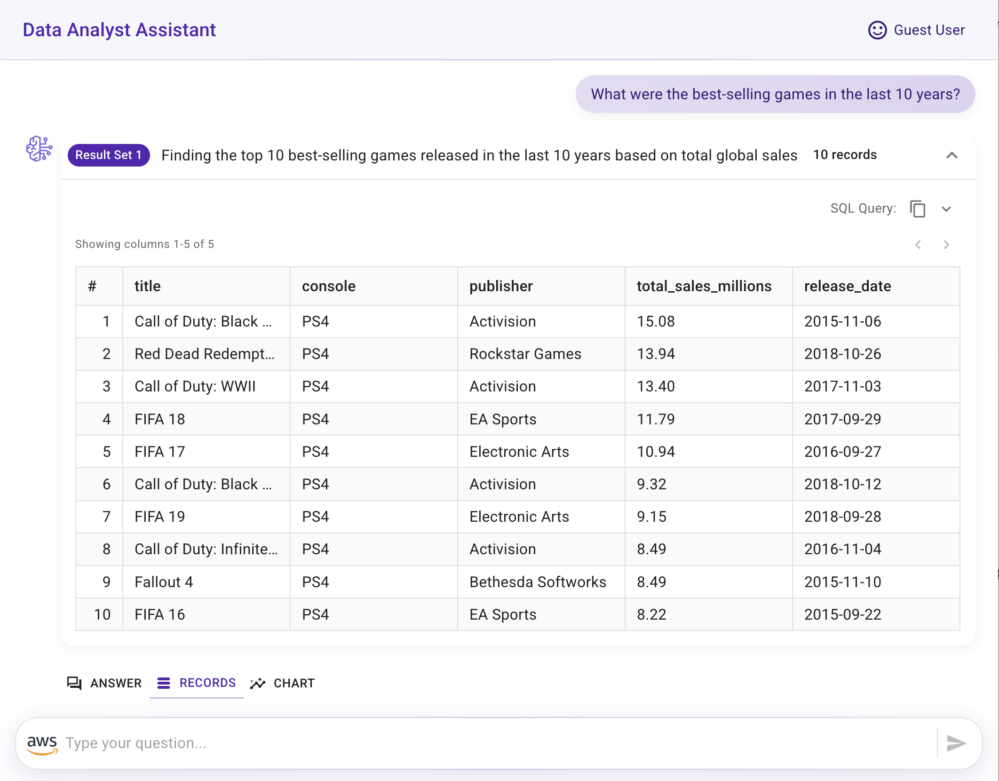
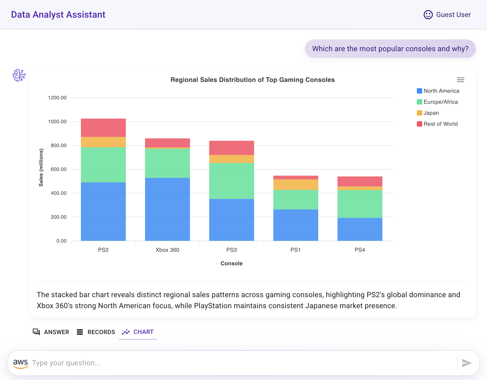

# Front-End Implementation - Integrating AgentCore with a Ready-to-Use Data Analyst Assistant Application

A powerful React-based web application that integrates with **[AWS Bedrock AgentCore](https://aws.amazon.com/bedrock/agentcore/)** to provide an intelligent data analysis interface for video game sales data.

## Overview

This application creates a conversational AI assistant that can analyze video game sales data through natural language queries. The integration utilizes **Amazon Bedrock AgentCore** to deploy and operate AI agents securely at scale using any framework and model.

The application uses the **[InvokeAgentRuntimeCommand](https://docs.aws.amazon.com/AWSJavaScriptSDK/v3/latest/client/bedrock-agentcore/command/InvokeAgentRuntimeCommand/)** from the AWS JavaScript SDK v3 to interact with the deployed AgentCore infrastructure.

### Key Features

- **Conversational AI Interface**: Chat with an intelligent assistant powered by Claude 3.5 Sonnet
- **Tabular Data Display**: View raw query results in organized tables
- **Dynamic Data Visualization**: Automatically generates chart visualizations

> [!IMPORTANT]
> This sample application is for demonstration purposes only and is not production-ready. Please validate the code against your organization's security best practices.

## Prerequisites

Ensure you have the following installed and configured:

- **[Agent Deployment - Strands Agent Infrastructure Deployment with AgentCore](../agentcore-strands-data-analyst-assistant)**
- **Node.js 18+**
- **React Scripts** - Install with: `npm install react-scripts`

## Set Up the Front-End Application

Install the React application dependencies:

``` bash
npm install
```

## Configure IAM User Access for Front-End Permissions

- **[Create an IAM user](https://docs.aws.amazon.com/IAM/latest/UserGuide/id_users_create.html)**
- **[Create Access key and Secret access key](https://docs.aws.amazon.com/keyspaces/latest/devguide/create.keypair.html)** for programmatic access
- Add an inline policy to this user with the following JSON (replace placeholder values with your actual ARNs).

Update the values with your **<account_id>** and **<question_answers_table_arn>**, which you can find in the outputs from the CDK project, and the **<agent_runtime_arn>** that was created previously.

``` json
{
    "Version": "2012-10-17",
    "Statement": [
        {
            "Sid": "InvokeBedrockModel",
            "Effect": "Allow",
            "Action": [
                "bedrock:InvokeModel"
            ],
            "Resource": [
                "arn:aws:bedrock:*:<account_id>:inference-profile/us.anthropic.claude-3-5-sonnet-20241022-v2:0",
                "arn:aws:bedrock:us-east-2::foundation-model/anthropic.claude-3-5-sonnet-20241022-v2:0",
                "arn:aws:bedrock:us-east-1::foundation-model/anthropic.claude-3-5-sonnet-20241022-v2:0",
                "arn:aws:bedrock:us-west-2::foundation-model/anthropic.claude-3-5-sonnet-20241022-v2:0"
            ]
        },
        {
            "Sid": "DynamoDB",
            "Effect": "Allow",
            "Action": [
                "dynamodb:Query"
            ],
            "Resource": "<question_answers_table_arn>"
        },
        {
            "Sid": "BedrockAgentCorePermissions",
            "Effect": "Allow",
            "Action": "bedrock-agentcore:InvokeAgentRuntime",
            "Resource": [
                "<agent_runtime_arn>",
                "<agent_runtime_arn>/runtime-endpoint/*"
            ]
        }
    ]
}
```

## Configure Environment Variables

- Rename the file **src/sample.env.js** to **src/env.js** and update the following environment variables:

    - AWS Credentials and Region:
        - **ACCESS_KEY_ID**
        - **SECRET_ACCESS_KEY**
        - **AWS_REGION**

    - You can find the DynamoDB table name in the CloudFormation Outputs from the CDK project:
        - **QUESTION_ANSWERS_TABLE_NAME** 

    - Also, you can update the general application description:
        - **APP_NAME**
        - **APP_SUBJECT**
        - **WELCOME_MESSAGE**

    - Amazon Bedrock AgentCore Runtime information you can find in the AWS Console
        - **AGENT_RUNTIME_ARN**
        - **AGENT_ENDPOINT_NAME**
        - **LAST_K_TURNS** AgentCore Memory value to retrieve the last K conversation turns for context memory
  

## Test Your Data Analyst Assistant

Start the application locally:

``` bash
npm start
```

Try these sample questions to test the assistant:

- Hello!
- How can you help me?
- What is the structure of the data?
- Which developers tend to get the best reviews?
- What were the total sales for each region between 2000 and 2010? Give me the data in percentages.
- What were the best-selling games in the last 10 years?
- What are the best-selling video game genres?
- Give me the top 3 game publishers.
- Give me the top 3 video games with the best reviews and the best sales.
- Which is the year with the highest number of games released?
- Which are the most popular consoles and why?
- Give me a short summary and conclusion of our conversation.

> [!TIP]
> 🚀 For production deployment, consider using **[AWS Amplify Hosting](https://aws.amazon.com/amplify/hosting/)** and integrate Amazon Cognito or another identity provider for proper authentication and authorization instead of using IAM user credentials.

## Application Features

Congratulations! Your Data Analyst Assistant can provide you with the following conversational experience:



- **Conversational interface with an agent responding to user questions**



- **Raw query results displayed in tabular format**



- **Chart visualization generated from the agent's answer and the data query results (created using [Apexcharts](https://apexcharts.com/))**.



- **Summary and conclusion derived from the data analysis conversation**


## Thank You

## License

This project is licensed under the Apache-2.0 License.