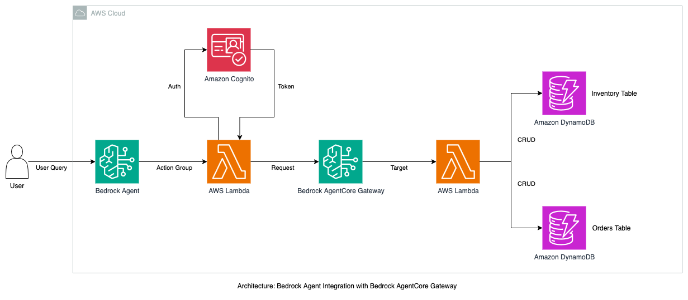

# Amazon Bedrock Agent Integration with Bedrock AgentCore Gateway

## Overview

This use case demonstrates a complete end-to-end integration between **Amazon Bedrock Agents** and **Amazon Bedrock AgentCore Gateway** using the **Model Context Protocol (MCP)** to connect with a practical fruit stand backend API built on AWS Lambda and DynamoDB. This showcase illustrates how MCP enables seamless communication between AI agents and existing backend systems, allowing agents to access real-world tools and data without requiring complex integration work.

**Key Integration Focus: Model Context Protocol (MCP)**
MCP is an open standard that enables AI agents to securely connect to external data sources and tools. In this use case:
- **Bedrock Agent** communicates with the Gateway using standard action group calls
- **AgentCore Gateway** translates these calls into MCP-compatible format
- **Backend Lambda functions** are automatically exposed as MCP tools
- **Real-time data access** is achieved through MCP's standardized protocol

### Use case details
| Information         | Details                                                                                                                             |
|---------------------|-------------------------------------------------------------------------------------------------------------------------------------|
| Use case type       | Conversational                                                                                                                      |
| Agent type          | Single agent                                                                                                                        |
| Use case components | Tools integration, MCP protocol, Authentication, Real-time data access, Natural language processing                                |
| Use case vertical   | E-commerce / Retail                                                                                                                 |
| Example complexity  | Intermediate                                                                                                                        |
| SDK used            | Amazon Bedrock AgentCore SDK, boto3                                                                                                |

### Use case Architecture



```
User Query → Bedrock Agent → Bridge Lambda → AgentCore Gateway → Backend Lambda → DynamoDB
```

### Use case key Features

- **Zero Backend Changes**: Existing Lambda functions work as-is with Gateway integration
- **Automatic Tool Discovery**: Gateway exposes Lambda functions as agent tools automatically
- **MCP Protocol Handling**: Gateway manages Model Context Protocol communication transparently
- **Natural Language Processing**: Bedrock Agent interprets user requests and selects appropriate tools
- **Real-time Data Integration**: Agent responses reflect live data from DynamoDB
- **Seamless Authentication**: Secure communication between all components

#### Key Components:

1. **Amazon Bedrock Agent**: Uses foundation model reasoning to understand user requests and orchestrate tool usage
2. **Bridge Lambda**: Translates Bedrock Agent action group calls to MCP format
3. **Amazon Bedrock AgentCore Gateway**: Automatically converts backend APIs into MCP-compatible tools
4. **Backend Lambda (Fruit Stand API)**: Existing business logic for inventory and order management
5. **DynamoDB Tables**: Data persistence layer for the fruit stand business
6. **Amazon Cognito**: Provides OAuth2 authentication for secure Gateway access

#### Authentication with Amazon Cognito

**Why Cognito is Required:**
Bedrock AgentCore Gateway requires secure authentication to protect your backend APIs. Amazon Cognito provides:

- **OAuth2 Client Credentials Flow**: Secure machine-to-machine authentication
- **JWT Token Management**: Automatic token generation and validation
- **Access Control**: Ensures only authorized agents can access your tools
- **Scalable Identity Management**: Handles authentication without custom code

**How It Works:**
1. Cognito User Pool acts as the identity provider
2. Client credentials (ID/Secret) are configured for the Gateway
3. Bridge Lambda automatically generates JWT tokens using Cognito
4. Gateway validates tokens before allowing tool access
5. Backend APIs remain secure behind authenticated Gateway

#### What This Demonstrates

**Amazon Bedrock Agents** uses the reasoning capabilities of foundation models (FMs), APIs, and data to break down user requests, gather relevant information, and efficiently complete tasks—freeing teams to focus on high-value work.

**Amazon Bedrock AgentCore Gateway** automatically converts APIs, Lambda functions, and existing services into MCP-compatible tools so developers can quickly make these essential capabilities available to agents without managing complex integrations.

#### The Integration Challenge Solved

Traditionally, connecting AI agents to existing backend systems requires complex API integration, protocol translation, tool management, and authentication handling. This use case demonstrates how Gateway eliminates these challenges by:

- **"What fruits are available?"** → Agent calls inventory tool via Gateway
- **"Create an order for Bob with 2 apples"** → Agent calls order creation tool  
- **"Get details for order ABC123"** → Agent retrieves order information

## Prerequisites

* Python 3.9 or higher
* AWS Account with appropriate permissions
* AWS CLI 2.x configured with credentials
* Jupyter Notebook or JupyterLab
* Internet connection for AWS API calls
* Access to the following AWS services:
  * Amazon Bedrock
  * AWS Lambda
  * Amazon DynamoDB
  * Amazon Cognito (for Gateway authentication)
  * AWS IAM
* Required AWS permissions: Ignore if running this sample from Admin role
  * `bedrock:*` - For Bedrock Agent operations
  * `lambda:*` - For Lambda function management
  * `dynamodb:*` - For DynamoDB table operations
  * `iam:*` - For role and policy management
  * `cognito-idp:*` - For OAuth2 authentication setup

## Use case setup

Install the prerequisite packages and configure your environment:

```bash
# Navigate to the project directory
cd 06-BedrockAgent-Integration

# create a virtual env
python -m venv .venv
.venv/bin/activate

# Install packages required for Bedrock AgentCore Gateway
pip install -r requirements.txt

# Install remaining packages
pip install jupyter notebook requests urllib3

# Configure AWS credentials
aws configure
```

## Execution instructions

Run the use case by executing the Jupyter notebook:

```bash
# Start Jupyter Notebook
jupyter notebook

# Open the notebook file
# Bedrock_Agent_Integration_with_Bedrock_AgentCore_Gateway.ipynb
```

Execute the notebook cells in order:

1. **Step 1-2**: Install dependencies and create IAM roles
2. **Step 3**: Create DynamoDB tables for orders and inventory
3. **Step 4**: Setup Cognito authentication
4. **Step 5**: Deploy the target Lambda function
5. **Step 6-7**: Create and configure the Bedrock AgentCore Gateway
6. **Step 8**: Test the gateway integration
7. **Step 9-12**: Create and configure the Bedrock Agent
8. **Step 13**: End-to-end testing

Once deployed, you can interact with the intelligent agent using natural language queries:

## Example Interactions

### Query 1: Check Available Inventory
**User Input:**
```
🤔 User: What fruits are available?
```

**Agent Response:**
```
🤖 Enhanced Agent: Here are the available fruits and their current prices and stock levels:

- Strawberries: $3.99 per pound, 25 pounds in stock
- Oranges: $0.75 each, 80 in stock  
- Bananas: $0.50 each, 148 in stock
- Apples: $1.20 each, 97 in stock
- Blueberries: $4.50 per pint, 30 pints in stock
```

### Query 2: Place an Order
**User Input:**
```
🤔 User: Create an order for Bob with 2 apples
```

**Agent Response:**
```
🤖 Enhanced Agent: The order for Bob with 2 apples has been successfully created. The order details are:

Order ID: e2c57daf
Customer Name: Bob
Items:
- 2 apples at $1.2 each, total $2.4
Total Cost: $2.4
Status: Pending
Created At: 2025-07-14T01:39:58.042975
```

### Query 3: Complex Order with Multiple Items
**User Input:**
```
🤔 User: I'd like to place an order for Alice with 3 apples and 2 bananas
```

**Agent Response:**
```
🤖 Enhanced Agent: Perfect! I've created an order for Alice. Here are the details:

Order ID: f8a9b2c1
Customer Name: Alice
Items:
- 3 apples at $1.20 each, total $3.60
- 2 bananas at $0.50 each, total $1.00
Total Cost: $4.60
Status: Pending
Created At: 2025-07-14T02:15:33.891234

The inventory has been automatically updated to reflect the new stock levels.
```

### Query 4: Check Order Status
**User Input:**
```
🤔 User: Can you get the details for order e2c57daf?
```

**Agent Response:**
```
🤖 Enhanced Agent: Here are the details for order e2c57daf:

Order ID: e2c57daf
Customer Name: Bob
Items:
- 2 apples at $1.20 each, total $2.40
Total Cost: $2.40
Status: Pending
Created At: 2025-07-14T01:39:58.042975
```

### What These Examples Show

1. **Natural Language Understanding**: The agent interprets various ways of asking for the same information
2. **Automatic Tool Selection**: Agent chooses the right backend function (list inventory, create order, get order)
3. **Real-time Data**: All responses reflect current database state
4. **Business Logic Integration**: Inventory automatically updates when orders are placed
5. **Structured Responses**: Agent formats data in user-friendly ways
6. **Error Handling**: System gracefully handles invalid requests or insufficient inventory

## Clean up instructions

To delete all created infrastructure and avoid ongoing charges, execute the cleanup section at the end of the notebook:

```bash
# Run the cleanup cells in the notebook to remove:
# - Bedrock Agent and Action Groups
# - Lambda functions (Bridge and Target)
# - Gateway and Gateway Targets
# - DynamoDB tables
# - Cognito resources
# - IAM roles and policies
```

## Troubleshooting

**Common Issues:**

1. **IAM Permission Errors**: Ensure your AWS credentials have sufficient permissions
2. **DynamoDB Decimal Errors**: The notebook handles Decimal type conversion automatically
3. **Gateway Timeout**: Increase Lambda timeout settings if operations take longer
4. **Authentication Failures**: Verify Cognito configuration and credentials

## Database Schema Reference

**FruitInventory Table:**
- `fruit_name` (String, Primary Key): Name of the fruit
- `price` (Number): Price per unit
- `unit` (String): Unit of measurement (each, pound, pint)
- `stock` (Number): Available quantity

**FruitOrders Table:**
- `order_id` (String, Primary Key): Unique order identifier
- `customer_name` (String): Customer name
- `items` (List): Ordered items with quantities and prices
- `total_cost` (Number): Total order cost
- `status` (String): Order status (pending, completed, etc.)
- `created_at` (String): ISO timestamp of order creation

## Disclaimer
The examples provided in this repository are for experimental and educational purposes only. They demonstrate concepts and techniques but are not intended for direct use in production environments. Make sure to have Amazon Bedrock Guardrails in place to protect against [prompt injection](https://docs.aws.amazon.com/bedrock/latest/userguide/prompt-injection.html).
